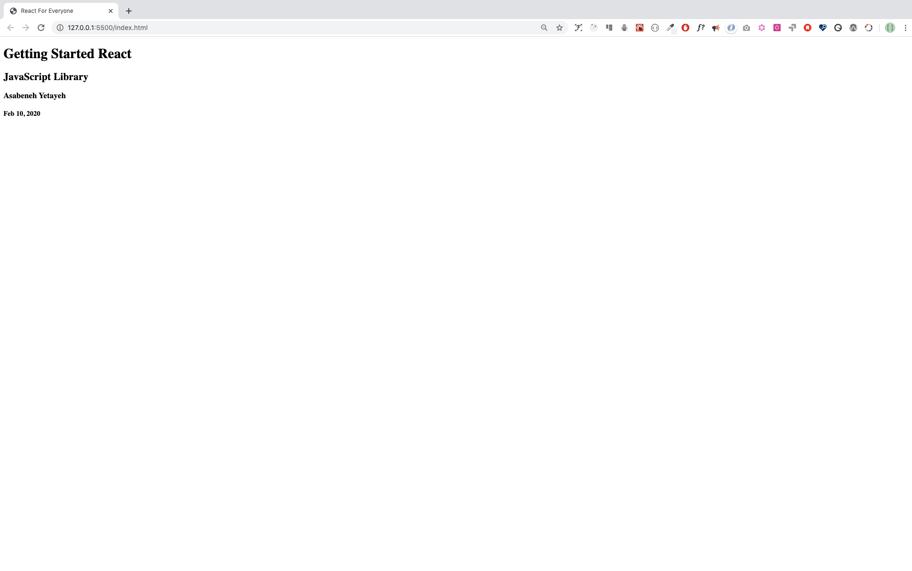
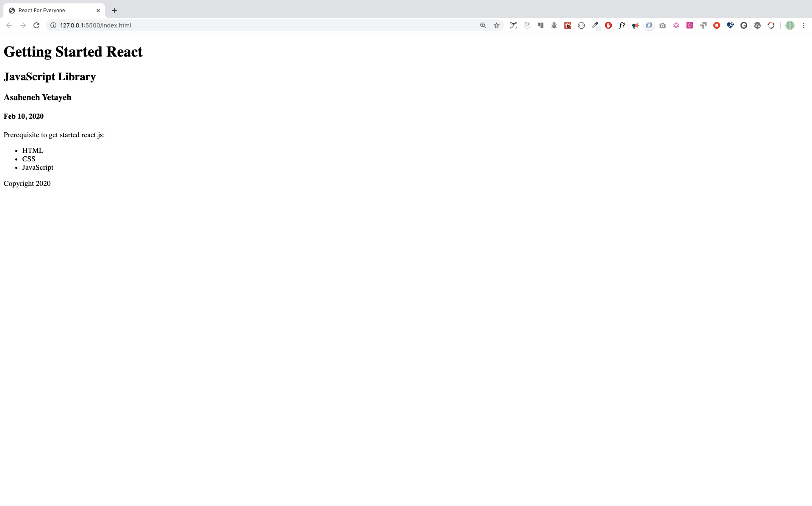

<div align="center">
  <h1> 30 Days Of React: Getting Started React</h1>
  <a class="header-badge" target="_blank" href="https://www.linkedin.com/in/asabeneh/">
  
  </a>
  <a class="header-badge" target="_blank" href="https://twitter.com/Asabeneh">
  
  </a>

<sub>Author:
<a href="https://www.linkedin.com/in/asabeneh/" target="_blank">Asabeneh Yetayeh</a><br>
<small> October 1, 2020</small>
</sub>

</div>
</div>

[<< Day 1](../readMe.md) | [Day 3 >>](../03_Day_Booleans_operators_date/03_booleans_operators_date.md)


- [Getting Started React](#getting-started-react)
  - [1. What is React?](#1-what-is-react)
  - [2. Why React?](#2-why-react)
    - [React vs Vue popularity in October 2020](#react-vs-vue-popularity-in-october-2020)
    - [React vs Vue popularity in February 2020](#react-vs-vue-popularity-in-february-2020)
  - [3. JSX](#3-jsx)
  - [JSX Element](#jsx-element)
  - [Rendering JSX Element](#rendering-jsx-element)
- [Style and className](#style-and-classname)
  - [Exercises: What is React?](#exercises-what-is-react)
  - [Exercises: Why React?](#exercises-why-react)
  - [Exercises: JSX](#exercises-jsx)
  - [Exercises:JSX Elements](#exercisesjsx-elements)
  - [Exercises - Inline Style](#exercises---inline-style)
  - [Exercises - Internal Styles](#exercises---internal-styles)

## Getting Started React

Prerequisite to get started with React. You should have a good understanding of the following technologies:

- HTML
- CSS
- JavaScript

If you have the above skills you will enjoy doing react.
React for Everyone contains anything you need to know about react. In every section, it has some exercise and mini-projects and it is recommended to work them.
This 30 Days Of React challenge will help you learn the latest version of React and old version step by step. The topics are broken down into 30 days, where each day contains several topics with easy-to-understand explanations, real-world examples and many hands on exercises.

This challenge is designed for beginners and professionals who want to build a web application using React and JavaScript.

### 1. What is React?

React is a JavaScript library for building a reusable user interfaces(UI). It was initially released on May 29, 2013. The current version is 16.13.1 and somehow it is stable. React was created by Facebook. React makes creating UI components very easy. When we work with react we do not interact directly with the DOM. React has its own way to handle the DOM(Document Object Model). React uses it virtual DOM to make a new change and it update only the element that needs change. Do not directly interact with DOM when you build react application leave that job for the virtual DOM. In this challenge, we will develop 10-15 web applications using React. A web application or a website is made up of buttons, links, forms with different input fields, header, footer, images, links, sections, articles, texts and boxes with different shapes. We use react to make a reusable UI component of a website.

To summarize:

- React was released in May 2013
- React was created by Facebook
- React is a JavaScript library for building user interfaces
- React is used to build single page applications- An application which has only one HTML page.
- React allows us to create reusable UI components
- React latest release is 16.13.1
- [React versions](https://reactjs.org/versions/)

### 2. Why React?

React is one of the most popular JavaScript library. Many developers and companies have been using it for the last couple of years. Its popularity has been growing fast and it has a huge community. How do we measure popularity? One measure of popularity could be GitHub repository stars, watchers and fork.Let us compare the popularity of [react](https://github.com/facebook/react) and [vue](https://github.com/vuejs/vue). As of today, the popularity between the two most popular JavaScript looks like as follows. From the diagram, you can speculate the most popular JavaScript library. You may look at the number of watchers, stars and forks for both React and Vue. These alone will not be a very good measure of popularity but still it tells something. If I have recommend another JavaScript library instead of React I would recommend Vue.js.

#### React vs Vue popularity in October 2020

React Official GitHub Repository


Vue Official GitHub Repository


#### React vs Vue popularity in February 2020

React Official GitHub Repository


Vue Official GitHub Repository


Why we choose to use react ? We use react because of the following reasons:

- fast
- modular
- scalable
- flexible
- big community and popular
- open source

### 3. JSX

JSX stands for JavaScript XML. JSX allows us to write HTML elements with JavaScript code. An HTML element has an opening and closing tag, content, and attribute in the opening tag. However, some HTML tag may not have a content and a closing tag, they are self closing elements. To create HTML elements in React we do not use the _createElement()_ instead we just use JSX elements. Therefore, JSX makes it easier to write and add HTML elements in React. JSX will be converted to JavaScript on browser using transpiler which [babel.js](https://babeljs.io/). Babel is a library which transpile JSX to pure JavaScript and latest JavaScript to older version. See the JSX code below.

```js
const jsxElement = <h1>I am a JSX element</h1>
```

The above strange looking code seems a JavaScrip but it is not JavaScript and it seems an HTML but not completely an HTML element. It is a mix of JavaScript and and an HTML element. JSX can allow us to use HTML in JavaScript. The HTML element in the above JSX is h1.

### JSX Element

As you have seen in the above example, JSX has a JavaScript and HTML like syntax. JSX element could be a single HTML element or many HTML elements wrapped in a parent HTML element.

This JSX element has only on HTML element which is h1.

```js
const jsxElement = <h1>I am a JSX element</h1>
```

Let's make more JSX elements by declaring a new variable name title and content inside h1.

```js
const title = <h1>Getting Started React</h1>
```

Let us add a subtitle to the above JSX element by adding additional HTML element. Every HTML element should be wrapped by an outer HTML element to create a valid JSX element. The name title variable also should be changed to header because our JSX element is containing almost all the header of the application.

```js
const header = (
  <header>
    <h1>Getting Started React</h1>
    <h2>JavaScript Library</h2>
  </header>
)
```

Let us keep adding more elements. Additional HTML element to display the author name and year.

```js
const header = (
  <header>
    <h1>Getting Started React</h1>
    <h2>JavaScript Library</h2>
    <h3>Asabeneh Yetayeh</h3>
    <p>Oct 1, 2020</p>
  </header>
)
```

As you can see the header element is a parent element for all the inner HTML elements and JSX must be wrapped by an outer parent element. Without the header HTML element or other parent HTML element the above JSX is invalid.

### Rendering JSX Element

To render a JSX element to HTML document. We should create on index HTML. The index.html is the only HTML file you will have in any react application. That is why every react application is a single page application. Let us create an index.html file.

```html
<!DOCTYPE html>
<html lang="en">
  <head>
    <meta charset="UTF-8" />
    <meta name="viewport" content="width=device-width, initial-scale=1.0" />
    <title>React For Everyone</title>
  </head>

  <body>
    <div class="root"></div>

    <script></script>
  </body>
</html>
```

As you can see from the above index.html, we have one div with a class root and script. The root div is the get way to connect all react component to the index.html. In the script tag, we will write our JavaScript but the script type will be babel. Babel will transpile the react JSX to pure JavaScript on the browser. Let us add babel to the script. Inside the babel, we can write any pure JavaScript, JSX and in general react code.

```html
<!DOCTYPE html>
<html lang="en">
  <head>
    <meta charset="UTF-8" />
    <meta name="viewport" content="width=device-width, initial-scale=1.0" />
    <title>React For Everyone</title>
  </head>

  <body>
    <div class="root"></div>
    <script src="https://unpkg.com/@babel/standalone/babel.min.js"></script>
    <script type="text/babel">
      // our code goes here
    </script>
  </body>
</html>
```

The babel library is linked to our document and now we can make use of it. The next step is importing React and ReactDOM using CDN or link. Attach the react and react-dom to your file. To test if react is connected to the index.html try to check by doing console.log(React). If you see an object containing react methods then you managed to React CND to your React project.

```html
<!DOCTYPE html>
<html lang="en">
  <head>
    <meta charset="UTF-8" />
    <meta name="viewport" content="width=device-width, initial-scale=1.0" />
    <title>30 Days Of React Challenge</title>
  </head>

  <body>
    <div class="root"></div>

    <script
      crossorigin
      src="https://unpkg.com/react@16/umd/react.development.js"
    ></script>
    <script
      crossorigin
      src="https://unpkg.com/react-dom@16/umd/react-dom.development.js"
    ></script>
    <script src="https://unpkg.com/@babel/standalone/babel.min.js"></script>
    <script type="text/babel">
      console.log(React)
    </script>
  </body>
</html>
```

Now the index.html has everything we need to write react code. Let us get the root element using document.querySelect('.root') and assign it to variable name rootElement. The is the only place we directly interact with DOM.

Now, you knew JSX and JSX element. Let us render the JSX element on the browser, in order to do so we need the react and ReactDOM library. In addition to the React and ReactDOM we need babel to transpile the JSX to JavaScript code. The ReactDOM package has a method render. The render method takes two arguments:a JSX element or a component and the root document. See the code below. [Live on code pen](https://codepen.io/Asabeneh/full/JjdbjqK).

```html
<!DOCTYPE html>
<html lang="en">
  <head>
    <meta charset="UTF-8" />
    <meta name="viewport" content="width=device-width, initial-scale=1.0" />
    <title>React For Everyone</title>
  </head>

  <body>
    <div class="root"></div>

    <script
      crossorigin
      src="https://unpkg.com/react@16/umd/react.development.js"
    ></script>
    <script
      crossorigin
      src="https://unpkg.com/react-dom@16/umd/react-dom.development.js"
    ></script>
    <script src="https://unpkg.com/@babel/standalone/babel.min.js"></script>
    <script type="text/babel">
      // To get the root element from the HTML document
      const rootElement = document.querySelector('.root')

      // JSX element
      const jsxElement = <h1>I am a JSX element</h1>

      // we render the JSX element using the ReactDOM package
      // ReactDOM has the render method and the render method takes two argument
      ReactDOM.render(jsxElement, rootElement)
    </script>
  </body>
</html>
```


Let us render more content. To render more content the JSX element should have more HTML elements. For instance, we can create a header of a website and header may have a title, subtitle, author or date etc.
[Live on code pen](https://codepen.io/Asabeneh/full/QWbGWeY).

```html
<!DOCTYPE html>
<html lang="en">
  <head>
    <meta charset="UTF-8" />
    <meta name="viewport" content="width=device-width, initial-scale=1.0" />
    <title>React For Everyone</title>
  </head>

  <body>
    <div class="root"></div>

    <script
      crossorigin
      src="https://unpkg.com/react@16/umd/react.development.js"
    ></script>
    <script
      crossorigin
      src="https://unpkg.com/react-dom@16/umd/react-dom.development.js"
    ></script>
    <script src="https://unpkg.com/@babel/standalone/babel.min.js"></script>
    <script type="text/babel">
      // To get the root element from the HTML document
      const rootElement = document.querySelector('.root')

      // JSX element
      const header = (
        <header>
          <h1>Getting Started React</h1>
          <h2>JavaScript Library</h2>
          <p>Asabeneh Yetayeh</p>
          <p>Oct 1, 2020</p>
        </header>
      )

      // we render the JSX element using the ReactDOM package
      // ReactDOM has the render method and the render method takes two argument
      ReactDOM.render(header, rootElement)
    </script>
  </body>
</html>
```



We have created a JSX element for the header of the website. How about the main and the footer for the website? Similar to the header, let us create a JSX element for the main and the footer.

JSX element for the main part of the website.

```js
// JSX element
const main = (
  <main>
    <p>Prerequisite to get started react.js:</p>
    <ul>
      <li>HTML</li>
      <li>CSS</li>
      <li>JavaScript</li>
    </ul>
  </main>
)
```

JSX element for the footer part of the website.

```js
// JSX element
const footer = (
  <footer>
    <p>Copyright 2020</p>
  </footer>
)
```

Now, we have three JSX elements:the header, main and footer. The best way to render all the three JSX elements is by wrapping them all in a parent JSX element. To include JSX element inside another JSX element we use the curly bracket, {} and call the name of the JSX inside the curly bracket.

```js
// JSX element for the header part of the website
const header = (
  <header>
    <h1>Getting Started React</h1>
    <h2>JavaScript Library</h2>
    <p>Asabeneh Yetayeh</p>
    <p>Oct 1, 2020</p>
  </header>
)

// JSX element for the main part of the website
const main = (
  <main>
    <p>Prerequisite to get started react.js:</p>
    <ul>
      <li>HTML</li>
      <li>CSS</li>
      <li>JavaScript</li>
    </ul>
  </main>
)

// JSX element for the footer part of the website
const footer = (
  <footer>
    <p>Copyright 2020</p>
  </footer>
)

// JSX element which contain all, it is a container or parent
const app = (
  <div>
    {header}
    {main}
    {footer}
  </div>
)
```

Now, let us put everything together and render it to the browser. [Live on code pen](https://codepen.io/Asabeneh/full/MWwbYWg).

```html
<!DOCTYPE html>
<html lang="en">
  <head>
    <meta charset="UTF-8" />
    <meta name="viewport" content="width=device-width, initial-scale=1.0" />
    <title>React For Everyone</title>
  </head>

  <body>
    <div class="root"></div>

    <script
      crossorigin
      src="https://unpkg.com/react@16/umd/react.development.js"
    ></script>
    <script
      crossorigin
      src="https://unpkg.com/react-dom@16/umd/react-dom.development.js"
    ></script>
    <script src="https://unpkg.com/@babel/standalone/babel.min.js"></script>
    <script type="text/babel">
      // To get the root element from the HTML document
      const rootElement = document.querySelector('.root')

      // JSX element, header
      const header = (
        <header>
          <h1>Getting Started React</h1>
          <h2>JavaScript Library</h2>
          <p>Asabeneh Yetayeh</p>
          <p>Oct 1, 2020</p>
        </header>
      )

      // JSX element, main
      const main = (
        <main>
          <p>Prerequisite to get started react.js:</p>
          <ul>
            <li>HTML</li>
            <li>CSS</li>
            <li>JavaScript</li>
          </ul>
        </main>
      )

      // JSX element, footer
      const footer = (
        <footer>
          <p>Copyright 2020</p>
        </footer>
      )

      // JSX element, app, a container or a parent
      const app = (
        <div>
          {header}
          {main}
          {footer}
        </div>
      )

      // we render the JSX element using the ReactDOM package
      // ReactDOM has the render method and the render method takes two argument
      ReactDOM.render(app, rootElement)
    </script>
  </body>
</html>
```



Let us apply some style to our JSX elements and see the result.

.

Now, lets us apply style the header part only [Live on code pen](https://codepen.io/Asabeneh/full/ZEGBYBG).

## Style and className

So far, we did apply any style. Now, let us add style to our JSX elements. Inline style became very popular after the emergence of react. Let us add border to the header JSX element.

To add style to a JSX element we use inline style or className. We inject the style object using {}. Every CSS properties become a key and every CSS properties value become value for the the object. For instance, in the example below, border is a key and '2px solid orange' is a value, color is a key and 'black' is a value, fontSize is a key and '18px' is a value. All two word CSS properties will change to camelCase when we use them as key in the CSS object in react or JavaScript.[Live on code pen](https://codepen.io/Asabeneh/full/ZEGBYbY).

```js
const header = (
  <header
    style={{ border: '2px solid orange', color: 'black', fontSize: '18px' }}
  >
    <h1>Getting Started React</h1>
    <h2>JavaScript Library</h2>
    <p>Asabeneh Yetayeh</p>
    <p>Feb 10, 2020</p>
  </header>
)

// or we can write it

const style = { border: '2px solid orange', color: 'black', fontSize: '18px' }

const header = (
  <header style={style}>
    <h1>Getting Started React</h1>
    <h2>JavaScript Library</h2>
    <h3>Asabeneh Yetayeh</h3>
    <p>Feb 10, 2020</p>
  </header>
)
```

It is good practice to open the browser console while you are developing your application to know if everything goes well.

Let us keep styling all the JSX elements we have created: the header, main and footer. We can also use regular internal styling to style our application. Using regular style, to target an HTML element we use tag name, id, class, an attribute and other methods. It is very common in the react developer community people use quite a lot classes instead of id. In this material, I will use only class instead of id.

In JSX element we write className instead of class because class is a reserved word in JavaScript. Similar to className, htmlFor instead of for in label tag. See the example below.

```js
const title = <h1 className='title'>Getting Started React</h1>
const inputField = (
  <div>
    <label htmlFor='firstname'>First Name</label>
    <input type='text' id='firstname' placeholder='First Name' />
  </div>
)
```

The id used in the input element is not for styling purpose instead to refer the label to the input field.

If class is used instead of className or for instead of htmlFor you will see such kind of warning.


Now, you know how to use the inline style and how to use className and let us style all the JSX elements.

```html
<!DOCTYPE html>
<html lang="en">
  <head>
    <meta charset="UTF-8" />
    <meta name="viewport" content="width=device-width, initial-scale=1.0" />
    <title>React For Everyone</title>
  </head>

  <body>
    <div class="root"></div>

    <script
      crossorigin
      src="https://unpkg.com/react@16/umd/react.development.js"
    ></script>
    <script
      crossorigin
      src="https://unpkg.com/react-dom@16/umd/react-dom.development.js"
    ></script>
    <script src="https://unpkg.com/@babel/standalone/babel.min.js"></script>
    <script type="text/babel">
      // To get the root element from the HTML document
      const rootElement = document.querySelector('.root')

      // style
      const headerStyles = {
        backgroundColor: '#61DBFB',
        fontFamily: 'Helvetica Neue',
        padding: 25,
        lineHeight: 1.5,
      }

      // JSX element, header
      const header = (
        <header style={headerStyles}>
          <div className='header-wrapper'>
            <h1>Getting Started React</h1>
            <h2>JavaScript Library</h2>
            <p>Asabeneh Yetayeh</p>
            <p>Feb 10, 2020</p>
          </div>
        </header>
      )

      // JSX element, main
      const mainStyles = {
        backgroundColor: '#F3F0F5',
      }
      const main = (
        <main style={mainStyles}>
          <p>Prerequisite to get started react.js:</p>
          <ul>
            <li>HTML</li>
            <li>CSS</li>
            <li> JavaScript</li>
          </ul>
        </main>
      )

      const footerStyles = {
        backgroundColor: '#61DBFB',
      }
      // JSX element, footer
      const footer = (
        <footer style={footerStyles}>
          <p>Copyright 2020</p>
        </footer>
      )

      // JSX element, app
      const app = (
        <div className='app'>
          {header}
          {main}
          {footer}
        </div>
      )

      // we render the JSX element using the ReactDOM package
      ReactDOM.render(app, rootElement)
    </script>
  </body>
</html>
```


Instead of style object using regular styling method is more easier than the above. Now, let us use internal style to style all the JSX. It is also possible to use external style method.[Live on code pen](https://codepen.io/Asabeneh/full/QWbGwge)

```html
<!DOCTYPE html>
<html lang="en">
  <head>
    <meta charset="UTF-8" />
    <meta name="viewport" content="width=device-width, initial-scale=1.0" />
    <link
      href="https://fonts.googleapis.com/css?family=Montserrat:300,400,500|Roboto:300,400,500&display=swap"
      rel="stylesheet"
    />

    <title>React For Everyone</title>
    <style>
      /* == General style === */
      * {
        box-sizing: border-box;
        padding: 0;
        margin: 0;
      }

      html,
      body {
        height: 100%;
        line-height: 1.5;
        font-family: 'Montserrat';
        font-weight: 300;
        color: black;
      }

      .root {
        min-height: 100%;
        position: relative;
      }

      .header-wrapper,
      .main-wrapper,
      .footer-wrapper {
        width: 85%;
        margin: auto;
      }

      .header-wrapper,
      .main-wrapper {
        padding: 10px;
        margin: 2px auto;
      }

      h1 {
        font-size: 70px;
        font-weight: 300;
      }

      h2,
      h3 {
        font-weight: 300;
      }

      header {
        background-color: #61dbfb;
        padding: 25;
        padding: 10px;
      }

      main {
        padding: 10px;
        padding-bottom: 60px;
        /* Height of the footer */
      }

      ul {
        margin-left: 15px;
      }

      ul li {
        list-style: none;
      }

      footer {
        position: absolute;
        bottom: 0;
        width: 100%;
        height: 60px;
        /* Height of the footer */
        background: #6cf;
      }

      .footer-wrapper {
        font-weight: 400;
        text-align: center;
        line-height: 60px;
      }
    </style>
  </head>

  <body>
    <div class="root"></div>

    <script
      crossorigin
      src="https://unpkg.com/react@16/umd/react.development.js"
    ></script>
    <script
      crossorigin
      src="https://unpkg.com/react-dom@16/umd/react-dom.development.js"
    ></script>
    <script src="https://unpkg.com/@babel/standalone/babel.min.js"></script>
    <script type="text/babel">
      // To get the root element from the HTML document
      const rootElement = document.querySelector('.root')

      // JSX element, header
      const header = (
        <header>
          <div className='header-wrapper'>
            <h1>Getting Started React</h1>
            <h2>JavaScript Library</h2>
            <p>Instructor: Asabeneh Yetayeh</p>
            <p>Date: Feb 10, 2020</p>
          </div>
        </header>
      )

      // JSX element, main
      const main = (
        <main>
          <div className='main-wrapper'>
            <p>
              Prerequisite to get started{' '}
              <strong>
                <em>react.js</em>
              </strong>
              :
            </p>
            <ul>
              <li>HTML</li>
              <li>CSS</li>
              <li> JavaScript</li>
            </ul>
          </div>
        </main>
      )

      // JSX element, footer
      const footer = (
        <footer>
          <div className='footer-wrapper'>
            <p>Copyright 2020</p>
          </div>
        </footer>
      )

      // JSX element, app
      const app = (
        <div className='app'>
          {header}
          {main}
          {footer}
        </div>
      )

      // we render the JSX element using the ReactDOM package
      ReactDOM.render(app, rootElement)
    </script>
  </body>
</html>
```


🌕 You are awesome. You have just completed day 2 challenges and you are two steps ahead on your way to greatness. Now do some exercises for your brain and for your muscle.

### Exercises: What is React?

1. What is React?
2. What is a library ?
3. What is single page application ?
4. What is component ?
5. What is the latest version of react ?
6. What is DOM ?
7. What is React Virtual DOM
8. What does a web application or a website(composed of) may have?

### Exercises: Why React?

1. Why you chose to use react?
2. What  measures do you use to know popularity ?
3. What is more popular, react or Vue ?

### Exercises: JSX

1. What is an HTML element ?
2. Write is a self closing HTML element ?
3. What is HTML attribute, write some HTML attributes ?
4. What is JSX ?
5. What is babel ?
6. What is a transpiler?

### Exercises:JSX Elements

1. What is JSX element
2. Write your name in JSX element and store it in a name variable
3. Write a JSX element which displays your full name, country, title, gender, email, phone number. Use h1 for the name and p for the rest of the information and store it in a user variable.
4. Write a footer JSX element

### Exercises - Inline Style

1. Create a style object for the main JSX
2. Create a style object for the footer and app JSX
3. Add more styles to the JSX elements

### Exercises - Internal Styles

1. Apply different styles to your JSX elements

🎉 CONGRATULATIONS ! 🎉

[<< Day 1](../readMe.md) | [Day 3 >>](../03_Day_Setting_Up/03_day_setting_up.md)
