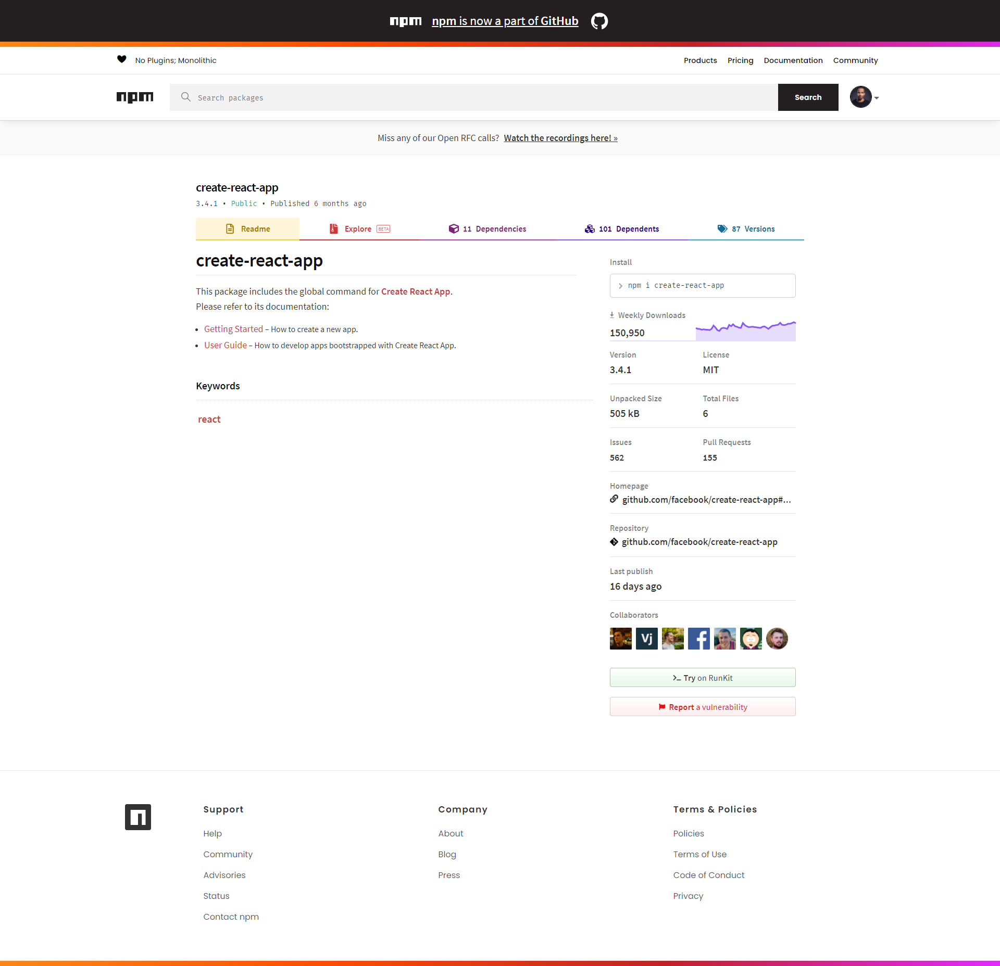
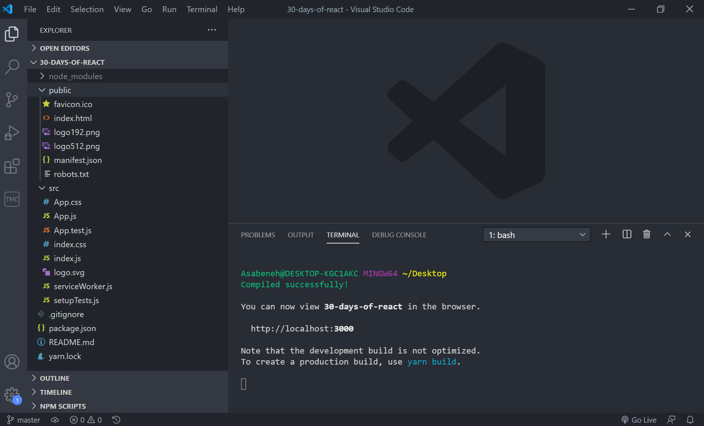
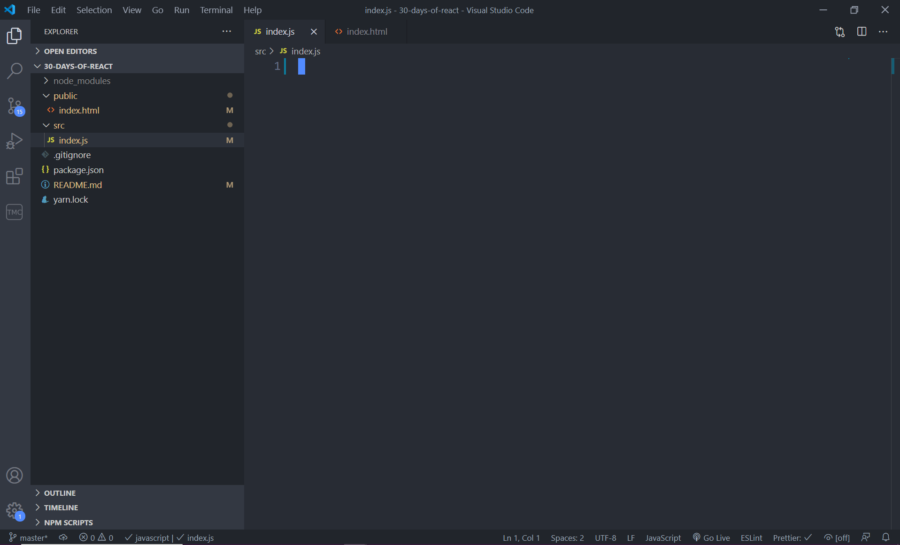
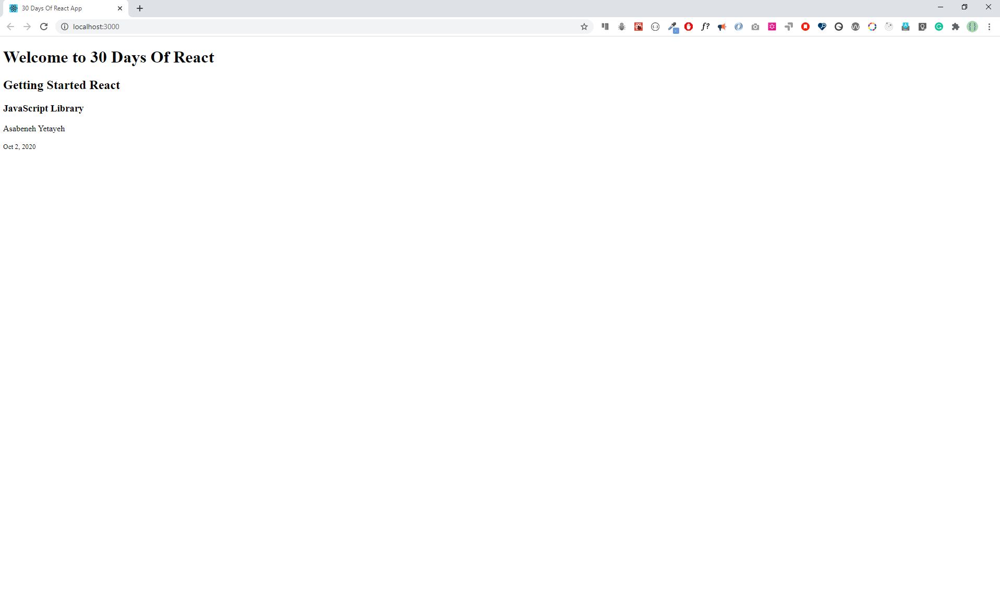
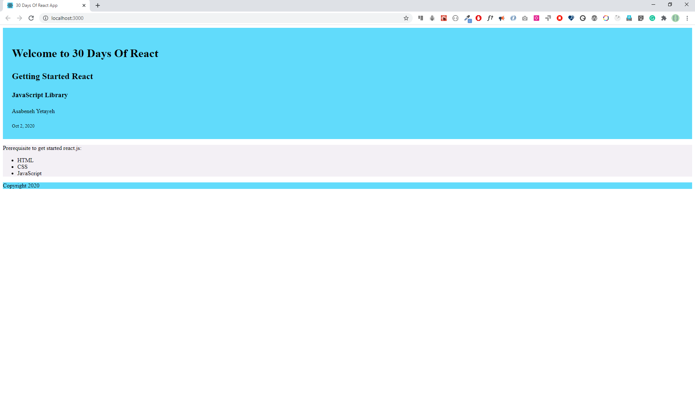
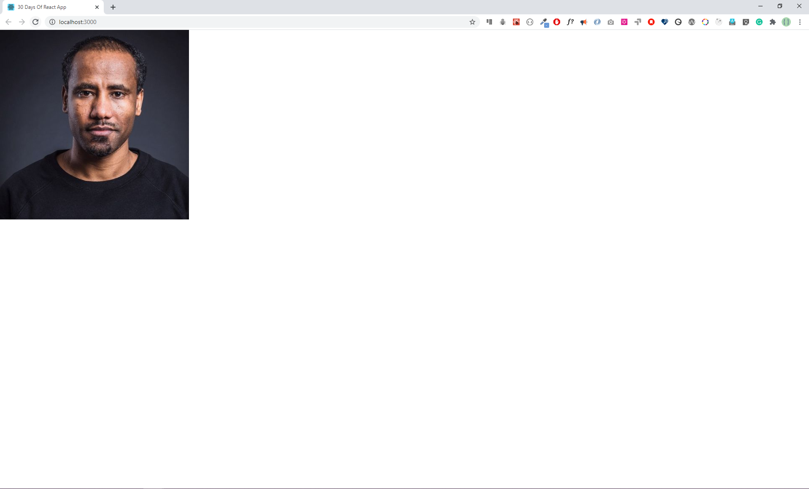
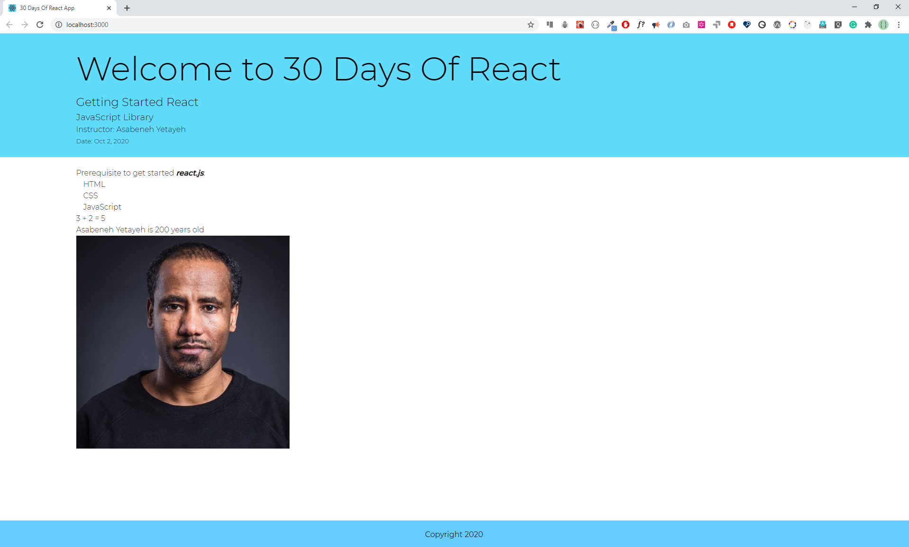

<div align="center">
  <h1> 30 Days Of React: Setting Up </h1>
  <a class="header-badge" target="_blank" href="https://www.linkedin.com/in/asabeneh/">
  
  </a>
  <a class="header-badge" target="_blank" href="https://twitter.com/Asabeneh">
  
  </a>

<sub>Author:
<a href="https://www.linkedin.com/in/asabeneh/" target="_blank">Asabeneh Yetayeh</a><br>
<small> October, 2020</small>
</sub>

</div>
</div>

[<< Day 2](../02_Day_Introduction_to_React/02_introduction_to_react.md) | [Day 4 >>](../04_Day_Components/04_components.md)


- [Setting Up](#setting-up)
  - [Node](#node)
  - [Module](#module)
  - [Package](#package)
  - [Node Package Manager(NPM)](#node-package-managernpm)
  - [Visual Studio Code](#visual-studio-code)
  - [Browser](#browser)
  - [Visual Studio Extensions](#visual-studio-extensions)
  - [Create React App](#create-react-app)
- [Your first React App](#your-first-react-app)
  - [React Boilerplate](#react-boilerplate)
  - [Styles in JSX](#styles-in-jsx)
  - [Injecting data to JSX elements](#injecting-data-to-jsx-elements)
  - [Importing Media Objects in React](#importing-media-objects-in-react)
- [Exercises](#exercises)
  - [Exercises: Level 1](#exercises-level-1)
  - [Exercises: Level 2](#exercises-level-2)
  - [Exercises: Level 3](#exercises-level-3)

# Setting Up

In the previous section, we learned about JSX and we accessed the React and ReactDOM package using CDN. However, in real projects instead of CDN you will use the create-react-app package to generate a React project starter(boilerplate). The initial _create-react-app_ was released on Jul 22, 2016. Before this time, developers used to configure webpack with a JavaScript module bundler, babel and all the necessary packages manually and this used to take half an hour or maybe more. Now, create-react-app will take care of everything and you will be in charge of only developing the product, instead of spending too much time configuring and setting up projects. Before we start using different tools, let's have a brief introduction to all the tools we are going to use in this challenge. You do not have to understand everything, but I will try to give a very short introduction to some of the tools and technologies that we use when we work with React.

## Node

Node is a JavaScript runtime environment that allows JavaScript to run on the server. Node was created in 2009. Node has played a great role for the growth of JavaScript. The React application starts by default at localhost 3000. The create-react-app has configured a node server for the React Application. That is why we need node and node modules. We will see create-react-app soon.

If you do not have node, install it. Install [node.js](https://nodejs.org/en/).


After downloading double click and install


We can check if node is installed on our local machine, by opening our device terminal or command prompt, and writing the following command:

```sh
asabeneh $ node -v
v12.18.0
```

## Module

A single or multiple functions, that can be exported and imported when needed, can be included in a project.
In React we do not use link to access modules or packages, instead we import the module. Let's see how to import and export a module or modules:

```js
// math.js
export const addTwo = (a, b) => a + b
export const multiply = (a, b) => a * b
export const subtract = (a, b) => a - b

export default (function doSomeMath() {
  return {
    addTwo,
    multiply,
    subtract,
  }
})()
```

Now let's import the _math.js_ modules to a different file:

```js
// index.js
// to import the doSomeMath from the math.js with or without extension
import doSomeMath from './math.js'

// to import the other modules
// since these modules were not exported as default we have to desctructure
import { addTwo, multiply, subtract } from './math.js'

import * as everything from './math.js' // to import everything remaining
console.log(addTwo(5, 5))
console.log(doSomeMath.addTwo(5, 5))
console.log(everything)
```

After this, when you see _import React from 'react'_ or _import ReactDOM from 'react-dom'_ you will not be surprised.

## Package

A Package is a module or a collection of modules. For instance, React, ReactDOM are packages.

## Node Package Manager(NPM)

NPM was created in 2010. You do not need to install NPM separately - when you install node you will have also NPM. NPM is a default package manager for Node.js. It allows users to consume and distribute JavaScript modules that are available in the registry. NPM allows to create packages, use packages and distribute packages. NMP also played quite a big role in the growth of JavaScript. Currently, there is more than 350,000 packages in the NPM registry. Let's see the create-react-app on NPM registry. The number of downloads show the popularity of the package.



## Visual Studio Code

We will use Visual Studio Code as a code editor. [Download](https://code.visualstudio.com) and install it if you do not have one yet.

## Browser

We will use Google Chrome

## Visual Studio Extensions

You may need to install these extensions from Visual Studio Code

- Prettier
- ESLint
- Bracket Pair Colorizer
- ES7 React/Redux/GraphQL/React-Native snippets

## Create React App

To create a react project you can use one of the following ways. Let's assume you installed node. Open the command line interface (CLI), git bash or terminal on Mac or Linux. Then run the following command. I am using git bash.

```sh
Asabeneh@DESKTOP-KGC1AKC MINGW64 ~/Desktop
$ npx create-react-app name-of-your-project
```

If you do not like to write npx every time you create a project you may install create-react-app package globally in your computer using the following command.

```sh
Asabeneh@DESKTOP-KGC1AKC MINGW64 ~/Desktop
$ npm install -g create-react-app
```

After you installed create-react-app, you create a React application as follows:

```sh
Asabeneh@DESKTOP-KGC1AKC MINGW64 ~/Desktop
$ create-react-app name-of-project
```

# Your first React App

```sh
Asabeneh@DESKTOP-KGC1AKC MINGW64 ~
\$ cd Desktop/
```

```sh
Asabeneh@DESKTOP-KGC1AKC MINGW64 ~/Desktop
\$ npx create-react-app 30-days-of-react
```

```sh
Asabeneh@DESKTOP-KGC1AKC MINGW64 ~/Desktop
\$ cd 30-days-of-react/
```

```sh
Asabeneh@DESKTOP-KGC1AKC MINGW64 ~/Desktop/30-days-of-react (master)
\$ npm start
```

Now your React app should run at localhost 3000. Go to the App.js and modify the content by writing some text, you will see the latest changes on the browser.
To stop the server, press Ctr + C in the CLI.


## React Boilerplate

Let's see the React boilerplate, which has been created by create-react-app. Whenever you create a new project, you run create-react-app and name of the project.

In the following React boilerplate, there are three folders: node_modules, public and src. In addition, there are .gitignore, README.md, package.json and yarn.lock. Some of you, instead of yarn.lock, you may have package-lock.json.

It is good to know these folders and files.

- node_modules - stores all the necessary node packages of the React applications.

- Public

  - index.html - the only HTML file we have in the entire application

  - favicon.ico - an icon file
  - manifest.json - is used to make the application a progressive web app
  - other images - open graph images(open graph images are images which are visible when a link share on social media)
  - robots.txt - information, if the website allows web scraping

- src

  - App.css, index.css - are different CSS files
  - index.js - a file which allows to connect all the components with index.html
  - App.js - A file where we usually import most of the presentational components
  - serviceWorker.js: is used to add progressive web app features
  - setupTests.js - to write testing cases

- package.json- List of packages the applications uses
- .gitignore - React boilerplate comes with git initiated, and the .gitingore allows files and folders not to be pushed to GitHub
- README.md - Markdown file to write documentation
- yarn.lock or package-lock.json - a means to lock the version of the package



Now lets remove all the files, which we do not need at the moment, and leave only the files we need right now.

After removing most of the files, the structure of the boilerplate looks like this:



Now lets write code on index.js. First of, we should import React and ReactDOM. React allows us to write JSX and ReactDOM to render the JSX on the DOM. ReactDOM has a render method. Let's use all the JSX elements we created on Day 2. The ReactDOM render method takes two parameters, a JSX or a component and the root.

```js
//index.js
// importing the react and react-dom package

import React from 'react'
import ReactDOM from 'react-dom'

const jsxElement = <h1>This is a JSX element</h1>
const rootElement = document.getElementById('root')

ReactDOM.render(jsxElement, rootElement)
```

```html
<!-- index.html -->
<!DOCTYPE html>
<html lang="en">
  <head>
    <meta charset="utf-8" />
    <meta name="viewport" content="width=device-width, initial-scale=1" />
    <link
      href="https://fonts.googleapis.com/css?family=Montserrat:300,400,500|Roboto:300,400,500&display=swap"
      rel="stylesheet"
    />
    <meta
      name="description"
      content="Web site created using create-react-app"
    />

    <title>30 Days Of React App</title>
  </head>
  <body>
    <div id="root"></div>
  </body>
</html>
```

If your application is not running, go to your project folder and run the following command

```sh
Asabeneh@DESKTOP-KGC1AKC MINGW64 ~/Desktop/30-days-of-react (master)
\$ npm start
```

If you do not have any bugs, your React app will be launched on the browser.


Let's write more JSX elements and render them on the browser. This expression is a JSX element which is made of h2 HTML element.

```js
const title = <h2>Getting Started React</h2>
```

Let's add more content to the previous JSX and change the name to header.

```js
const header = (
  <header>
    <h1>Welcome to 30 Days Of React</h1>
    <h2>Getting Started React</h2>
    <h3>JavaScript Library</h3>
  </header>
)
```

Let's render this to the browser, in order to do so, we need ReactDOM.

```js
//index.js
// importing the react and react-dom package

import React from 'react'
import ReactDOM from 'react-dom'

const header = (
  <header>
    <h1>Welcome to 30 Days Of React</h1>
    <h2>Getting Started React</h2>
    <h3>JavaScript Library</h3>
    <p>Asabeneh Yetayeh</p>
    <small>Oct 2, 2020</small>
  </header>
)
const rootElement = document.getElementById('root')

ReactDOM.render(header, rootElement)
```



Now, lets add all the JSX we created on Day 2.

```js
//index.js
// importing the react and react-dom package
import React from 'react'
import ReactDOM from 'react-dom'

// JSX element, header
const header = (
  <header>
    <h1>Welcome to 30 Days Of React</h1>
    <h2>Getting Started React</h2>
    <h3>JavaScript Library</h3>
    <p>Asabeneh Yetayeh</p>
    <small>Oct 2, 2020</small>
  </header>
)

// JSX element, main
const main = (
  <main>
    <p>Prerequisite to get started react.js:</p>
    <ul>
      <li>HTML</li>
      <li>CSS</li>
      <li>JavaScript</li>
    </ul>
  </main>
)

// JSX element, footer
const footer = (
  <footer>
    <p>Copyright 2020</p>
  </footer>
)

// JSX element, app, a container or a parent
const app = (
  <div>
    {header}
    {main}
    {footer}
  </div>
)

const rootElement = document.getElementById('root')
// we render the JSX element using the ReactDOM package
// ReactDOM has the render method and the render method takes two argument
ReactDOM.render(app, rootElement)
// or
//  ReactDOM.render([header, main, footer], rootElement)
```


## Styles in JSX

Let's apply style to the JSX elements. We can style JSX either using inline, internal or external CSS styles. Now, let's apply inline styles to each JSX element.

```js
// index.js
import React from 'react'
import ReactDOM from 'react-dom'

const headerStyles = {
  backgroundColor: '#61DBFB',
  fontFamily: 'Helvetica Neue',
  padding: 25,
  lineHeight: 1.5,
}

// JSX element, header
const header = (
  <header style={headerStyles}>
    <div className='header-wrapper'>
      <h1>Welcome to 30 Days Of React</h1>
      <h2>Getting Started React</h2>
      <h3>JavaScript Library</h3>
      <p>Asabeneh Yetayeh</p>
      <small>Oct 2, 2020</small>
    </div>
  </header>
)

// JSX element, main
const mainStyles = {
  backgroundColor: '#F3F0F5',
}
const main = (
  <main style={mainStyles}>
    <p>Prerequisite to get started react.js:</p>
    <ul>
      <li>HTML</li>
      <li>CSS</li>
      <li>JavaScript</li>
    </ul>
  </main>
)

const footerStyles = {
  backgroundColor: '#61DBFB',
}
// JSX element, footer
const footer = (
  <footer style={footerStyles}>
    <p>Copyright 2020</p>
  </footer>
)

// JSX element, app
const app = (
  <div className='app'>
    {header}
    {main}
    {footer}
  </div>
)

const rootElement = document.getElementById('root')
// we render the JSX element using the ReactDOM package
ReactDOM.render(app, rootElement)
```



Now, lets apply an internal style, we put all the CSS in the header of the index.html.

```js
// index.js
import React from 'react'
import ReactDOM from 'react-dom'
// JSX element, header
const header = (
  <header>
    <div className='header-wrapper'>
      <h1>Welcome to 30 Days Of React</h1>
      <h2>Getting Started React</h2>
      <h3>JavaScript Library</h3>
      <p>Instructor: Asabeneh Yetayeh</p>
      <small>Date: Oct 1, 2020</small>
    </div>
  </header>
)

// JSX element, main
const main = (
  <main>
    <div className='main-wrapper'>
      <p>
        Prerequisite to get started{' '}
        <strong>
          <em>react.js</em>
        </strong>
        :
      </p>
      <ul>
        <li>HTML</li>
        <li>CSS</li>
        <li> JavaScript</li>
      </ul>
    </div>
  </main>
)

// JSX element, footer
const footer = (
  <footer>
    <div className='footer-wrapper'>
      <p>Copyright 2020</p>
    </div>
  </footer>
)

// JSX element, app
const app = (
  <div className='app'>
    {header}
    {main}
    {footer}
  </div>
)

const rootElement = document.getElementById('root')
// we render the JSX element using the ReactDOM package
ReactDOM.render(app, rootElement)
```


## Injecting data to JSX elements

```js
// index.js
import React from 'react'
import ReactDOM from 'react-dom'
// To get the root element from the HTML document

// JSX element, header
const welcome = 'Welcome to 30 Days Of React'
const title = 'Getting Started React'
const subtitle = 'JavaScript Library'
const author = {
  firstName: 'Asabeneh',
  lastName: 'Yetayeh',
}
const date = 'Oct 2, 2020'

// JSX element, header
const header = (
  <header>
    <div className='header-wrapper'>
      <h1>{welcome}</h1>
      <h2>{title}</h2>
      <h3>{subtitle}</h3>
      <p>
        Instructor: {author.firstName} {author.lastName}
      </p>
      <small>Date: {date}</small>
    </div>
  </header>
)

const numOne = 3
const numTwo = 2

const result = (
  <p>
    {numOne} + {numTwo} = {numOne + numTwo}
  </p>
)

const yearBorn = 1820
const currentYear = new Date().getFullYear()
const age = currentYear - yearBorn
const personAge = (
  <p>
    {' '}
    {author.firstName} {author.lastName} is {age} years old
  </p>
)

// JSX element, main
const techs = ['HTML', 'CSS', 'JavaScript']
const techsFormatted = techs.map((tech) => <li>{tech}</li>)

// JSX element, main
const main = (
  <main>
    <div className='main-wrapper'>
      <p>
        Prerequisite to get started{' '}
        <strong>
          <em>react.js</em>
        </strong>
        :
      </p>
      <ul>{techsFormatted}</ul>
      {result}
      {personAge}
    </div>
  </main>
)

const copyRight = 'Copyright 2020'

// JSX element, footer
const footer = (
  <footer>
    <div className='footer-wrapper'>
      <p>{copyRight}</p>
    </div>
  </footer>
)

// JSX element, app
const app = (
  <div className='app'>
    {header}
    {main}
    {footer}
  </div>
)

const rootElement = document.getElementById('root')
// we render the JSX element using the ReactDOM package
ReactDOM.render(app, rootElement)
```


## Importing Media Objects in React

How do we import images, video and audio in React? Let's see how we import images first.
Create images folder in the src folder and save an image inside. For instance let's save asabeneh.jpg image and let's import this image to index.js. After importing we will inject it to a JSX expression, user. See the code below.

```js
// index.js
import React from 'react'
import ReactDOM from 'react-dom'
import asabenehImage from './images/asabeneh.jpg'

const user = (
  <div>
    
  </div>
)

const rootElement = document.getElementById('root')
// we render the JSX element using the ReactDOM package
ReactDOM.render(user, rootElement)
```



Let's inject the user inside the main JSX element and see the result:

```js
// index.js
import React from 'react'
import ReactDOM from 'react-dom'
// To get the root element from the HTML document
import asabenehImage from './images/asabeneh.jpg'
// JSX element, header
const welcome = 'Welcome to 30 Days Of React'
const title = 'Getting Started React'
const subtitle = 'JavaScript Library'
const author = {
  firstName: 'Asabeneh',
  lastName: 'Yetayeh',
}
const date = 'Oct 2, 2020'

// JSX element, header
const header = (
  <header>
    <div className='header-wrapper'>
      <h1>{welcome}</h1>
      <h2>{title}</h2>
      <h3>{subtitle}</h3>
      <p>
        Instructor: {author.firstName} {author.lastName}
      </p>
      <small>Date: {date}</small>
    </div>
  </header>
)

const numOne = 3
const numTwo = 2

const result = (
  <p>
    {numOne} + {numTwo} = {numOne + numTwo}
  </p>
)

const yearBorn = 1820
const currentYear = new Date().getFullYear()
const age = currentYear - yearBorn
const personAge = (
  <p>
    {' '}
    {author.firstName} {author.lastName} is {age} years old
  </p>
)

// JSX element, main
const techs = ['HTML', 'CSS', 'JavaScript']
const techsFormatted = techs.map((tech) => <li>{tech}</li>)

const user = (
  <div>
    
  </div>
)

// JSX element, main
const main = (
  <main>
    <div className='main-wrapper'>
      <p>
        Prerequisite to get started{' '}
        <strong>
          <em>react.js</em>
        </strong>
        :
      </p>
      <ul>{techsFormatted}</ul>
      {result}
      {personAge}
      {user}
    </div>
  </main>
)

const copyRight = 'Copyright 2020'

// JSX element, footer
const footer = (
  <footer>
    <div className='footer-wrapper'>
      <p>{copyRight}</p>
    </div>
  </footer>
)

// JSX element, app
const app = (
  <div className='app'>
    {header}
    {main}
    {footer}
  </div>
)

const rootElement = document.getElementById('root')
// we render the JSX element using the ReactDOM package
ReactDOM.render(app, rootElement)
```



The boilerplate code can be found [here](../03/../03_Day_Setting_Up/30-days-of-react_boilerplate)

# Exercises

## Exercises: Level 1

1. What is a module?
2. What is package?
3. What is the difference between a module and a package.
4. What is NPM?
5. What is Webpack?
6. How do you create a new React project?
7. What are the files and folders inside a project folder(package.json, package-lock.json or yarn.lock, .gitignore,node_modules and public)?
8. What is your favorite code editor (I believe that it is Visual Studio Code)?
9. Add different Visual Studio Code extensions to improve your productivity(eg. prettier, ESLint etc).
10. Try to make a different custom module in a different file and import it to index.js.

## Exercises: Level 2

1. Import and render the following images
   

2. Use h1, p, input and button HTML elements to create the following design using JSX


## Exercises: Level 3

1. Design the following user card.


🎉 CONGRATULATIONS ! 🎉

[<< Day 2](../02_Day_Introduction_to_React/02_introduction_to_react.md) | [Day 4 >>](../04_Day_Components/04_components.md)
