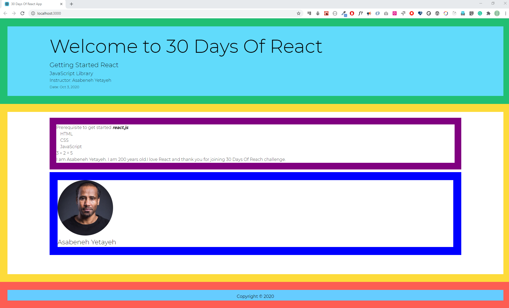
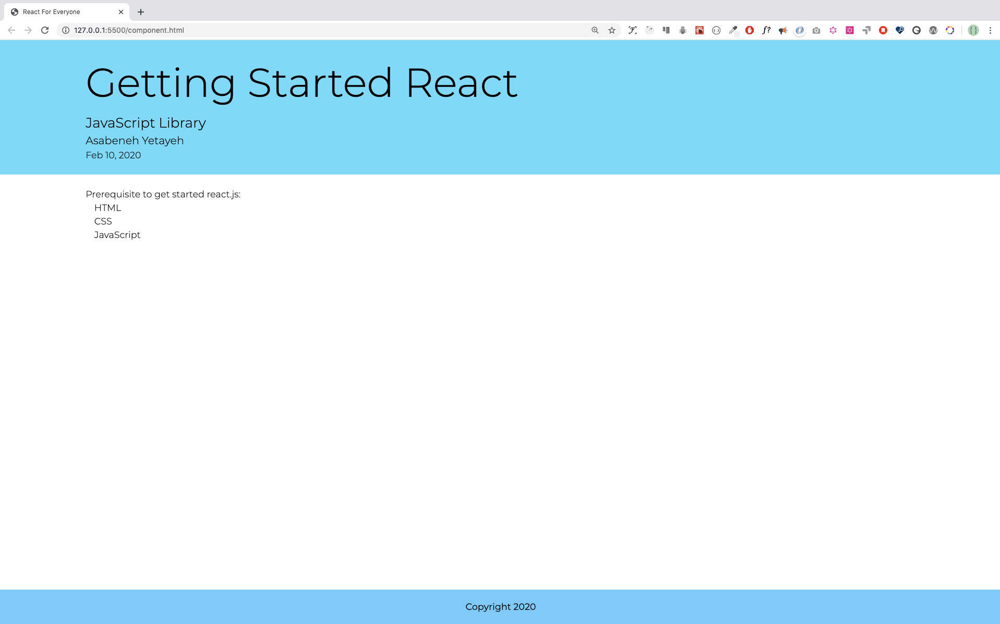

<div align="center">
  <h1> 30 Days Of React: Components </h1>
  <a class="header-badge" target="_blank" href="https://www.linkedin.com/in/asabeneh/">
  
  </a>
  <a class="header-badge" target="_blank" href="https://twitter.com/Asabeneh">
  
  </a>

<sub>Author:
<a href="https://www.linkedin.com/in/asabeneh/" target="_blank">Asabeneh Yetayeh</a><br>
<small> October, 2020</small>
</sub>

</div>
</div>

[<< Day 3](../30-Days-Of-React/03_Day_Setting_Up/03_day_setting_up.md) | [Day 5 >>]()


- [Components](#components)
  - [Big picture of components](#big-picture-of-components)
  - [JavaScript function](#javascript-function)
  - [JavaScript Class](#javascript-class)
  - [Creating React Component](#creating-react-component)
    - [Functional Component](#functional-component)
    - [Rendering components](#rendering-components)
    - [Injecting data to JSX in React Component](#injecting-data-to-jsx-in-react-component)
    - [Further on Functional components](#further-on-functional-components)
- [Exercises: Components](#exercises-components)

# Components

A React component is small reusable code which is responsible for one part of the application UI. A React application is an aggregation of components. React can help us to build reusable components. The following diagram shows different components. All the components have different border colors. In react we assemble different components together to create an application. We use a JavaScript function or class to make components. If we use a function the component will be a functional component but if we use class the function will be a class based component.

Components can be:

- Functional Component / Presentational Component / stateless component / Dumb components
- Class Component / Container Component/ State full component / smart components

The above classifications of components does not work for the latest version of react but it is good to know the former definition and how the previous versions work.

So, let us change all the JSX to components. Components in React are JavaScript functions or class which return a JSX. Component name must start with an uppercase and if the name is two word should be CamelCase, camel with two humps.

## Big picture of components

In the previous section, we agree that a website or an application is made of buttons, forms, texts, media objects, header, section, article and footer. If we have a million dollar button we can use this button all the time instead of creating all over again whenever we need a button the same goes for input fields, forms, header or footer. That is where the power of component comes. In the following diagram, the header, main and footer are components. Inside the main also there is a user card component and a text section component. All the different colors represent different components. How many colors do you see? We have five components in this diagram.



Before we jump into React components let's do some functions and class refreshers.

## JavaScript function

A JavaScript function could be either a regular function or an arrow function. There is a slight difference between an regular function and an arrow functions.

```js
const getUserInfo = (firstName, lastName, country, title, skills) => {
  return `${firstName} ${lastName},  a ${title} developer base in ${country}. He knows ${skills.join(
    ' '
  )} `
}
// When we call this function we need parameters
console.log(
  getUserInfo('Asabeneh', 'Yetayeh', 'Finland', 'FullStack Developer')
)
```

## JavaScript Class

Class is a blue print of an object. We instantiate a class to create different objects. In addition, we can create children by inheriting all the methods and properties of the parent.

```js
class Parent {
  constructor(firstName, lastName, country, title) {
    // we bind the params with this class object using this keyword
    this.firstName = firstName
    this.lastName = lastName
    this.country = country
    this.title = title
  }
  getPersonInfo() {
    return `${this.firstName} ${this.lastName},  a ${this.title} developer base in ${this.country} `
  }
  parentMethod() {
    // code goes here
  }
}

const p1 = Parent('Asabeneh', 'Yetayeh', 'Finland', 'FullStack Developer')

class Child extends Parent {
  constructor(firstName, lastName, country, title, skills) {
    super(firstName, lastName, country, title)
    this.skills = skills
    // we bind the child params with the this keyword to this child object
  }
  getSkills() {
    let len = this.skills.length
    return len > 0 ? this.skills.join(' ') : 'No skills found'
  }
  childMethod() {
    // code goes here
  }
}

const child = new Child(
  'Asabeneh',
  'Yetayeh',
  'Finland',
  'FullStack Developer',
  ['HTML', 'CSS', 'JS', 'React']
)
```

We covered function and class in brief and React component is made from JavaScript functions or class. Now, lets make React component.

## Creating React Component

### Functional Component

Using a JavaScript function we can make a functional React component.

```js
// React component syntax
// it can be arrow function, function declaration or function expression
const jsx = <tag> Content </tag>
const ComponentName = () => {
  return jsx
}
```

The following expression is a JSX element.

```js
// JSX element, header
const header = (
  <header style={headerStyles}>
    <div className='header-wrapper'>
      <h1>Welcome to 30 Days Of React</h1>
      <h2>Getting Started React</h2>
      <h3>JavaScript Library</h3>
      <p>Asabeneh Yetayeh</p>
      <small>Oct 3, 2020</small>
    </div>
  </header>
)

// React Component
const Header = () => {
  return header
}

// or we can just return the JSX

const Header = () => {
  return (
    <header style={headerStyles}>
      <div className='header-wrapper'>
        <h1>Welcome to 30 Days Of React</h1>
        <h2>Getting Started React</h2>
        <h3>JavaScript Library</h3>
        <p>Asabeneh Yetayeh</p>
        <small>Oct 3, 2020</small>
      </div>
    </header>
  )
}

// Even th above code can be written like this
// Explicitly returning the JSX
const Header = () => (
  <header style={headerStyles}>
    <div className='header-wrapper'>
      <h1>Welcome to 30 Days Of React</h1>
      <h2>Getting Started React</h2>
      <h3>JavaScript Library</h3>
      <p>Asabeneh Yetayeh</p>
      <small>Oct 3, 2020</small>
    </div>
  </header>
)
```

### Rendering components

Now, lets change all the JSX elements we had to components. When we call JSX element we use curly brackets and when we call components we do as follows <ComponentName />. If we pass an attribute when we call the component name, we call it props(<ComponentName propsName = {'data type'} />). We will talk about props in its section.[Live on code pen](https://codepen.io/Asabeneh/full/wvaKKEM)

Let's render first the _Header_ component.

```js
// index.js
import React from 'react'
import ReactDOM from 'react-dom'

// Header Component
const Header = () => (
  <header>
    <div className='header-wrapper'>
      <h1>Welcome to 30 Days Of React</h1>
      <h2>Getting Started React</h2>
      <h3>JavaScript Library</h3>
      <p>Asabeneh Yetayeh</p>
      <small>Oct 3, 2020</small>
    </div>
  </header>
)

const rootElement = document.getElementById('root')
// we render the JSX element using the ReactDOM package
ReactDOM.render(<Header />, rootElement)
```

Now, let's create an App component which hold the Header, Main and Footer. Then the App component will be render on the DOM.

```js
// index.js
import React from 'react'
import ReactDOM from 'react-dom'
import asabenehImage from './images/asabeneh.jpg'

// Header Component
const Header = () => (
  <header>
    <div className='header-wrapper'>
      <h1>Welcome to 30 Days Of React</h1>
      <h2>Getting Started React</h2>
      <h3>JavaScript Library</h3>
      <p>Asabeneh Yetayeh</p>
      <small>Oct 3, 2020</small>
    </div>
  </header>
)

// User Card Component
const UserCard = () => (
  <div className='user-card'>
    
    <h2>Asabeneh Yetayeh</h2>
  </div>
)

// TechList Component
const TechList = () => {
  const techs = ['HTML', 'CSS', 'JavaScript']
  const techsFormatted = techs.map((tech) => <li key={tech}>{tech}</li>)
  return techsFormatted
}

// Main Component
const Main = () => (
  <main>
    <div className='main-wrapper'>
      <p>Prerequisite to get started react.js:</p>
      <ul>
        <TechList />
      </ul>
      <UserCard />
    </div>
  </main>
)

// Footer Component
const Footer = () => (
  <footer>
    <div className='footer-wrapper'>
      <p>Copyright 2020</p>
    </div>
  </footer>
)

// The App, or the parent or the container component
const App = () => (
  <div className='app'>
    <Header />
    <Main />
    <Footer />
  </div>
)

const rootElement = document.getElementById('root')
// we render the JSX element using the ReactDOM package
ReactDOM.render(<App />, rootElement)
```



### Injecting data to JSX in React Component

So far, we used static data on the JSX elements now let's pass different data types as a dynamic data. The dynamic data could be string, number, boolean, array or object. Let us see each of the data types step by step. To inject data to a JSX we use the {} bracket.

In this section we only inject only strings

```js
import React from 'react'
import ReactDOM from 'react-dom'

const welcome = 'Welcome to 30 Days Of React'
const title = 'Getting Started React'
const subtitle = 'JavaScript Library'
const firstName = 'Asabeneh'
const lastName = 'Yetayeh'
const date = 'Oct 3, 2020'

// JSX element, header
const header = () => {
  return (
    <header>
      <div className='header-wrapper'>
        <h1>{welcome}</h1>
        <h2>{title}</h2>
        <h3>{subtitle}</h3>
        <p>
          Instructor: {firstName} {lastName}
        </p>
        <small>Date: {date}</small>
      </div>
    </header>
  )
}
const rootElement = document.getElementById('root')
// we render the JSX element using the ReactDOM package
ReactDOM.render(<Header />, rootElement)
```

Similar to the Header component we can implement to Main and Footer component.

```js
// To get the root element from the HTML document
const rootElement = document.querySelector('.root')
// JSX element, header
const welcome = 'Welcome to 30 Days Of React Challenge'
const title = 'Getting Started React'
const subtitle = 'JavaScript Library'
const author = {
  firstName: 'Asabeneh',
  lastName: 'Yetayeh',
}
const date = 'Oct 2, 2020'

// JSX element, header
const Header = () => (
  <header>
    <div className='header-wrapper'>
      <h1>{welcome}</h1>
      <h2>{title}</h2>
      <h3>{subtitle}</h3>
      <p>
        Instructor: {author.firstName} {author.lastName}
      </p>
      <small>Date: {date}</small>
    </div>
  </header>
)

const numOne = 3
const numTwo = 2

const result = (
  <p>
    {numOne} + {numTwo} = {numOne + numTwo}
  </p>
)

const yearBorn = 1820
const currentYear = 2020
const age = currentYear - yearBorn
const personAge = (
  <p>
    {' '}
    {author.firstName} {author.lastName} is {age} years old
  </p>
)

// User Card Component
const UserCard = () => (
  <div className='user-card'>
    
    <h2>
      {author.firstName} {author.lastName}
    </h2>
  </div>
)

// JSX element, main
const techs = ['HTML', 'CSS', 'JavaScript']
const techsFormatted = techs.map((tech) => <li key={tech}>{tech}</li>)

// JSX element, main
const Main = () => (
  <main>
    <div className='main-wrapper'>
      <div>
        <p>
          Prerequisite to get started{' '}
          <strong>
            <em>react.js</em>
          </strong>
          :
        </p>
        <ul>{techsFormatted}</ul>
        {result}
        {personAge}
      </div>
      <UserCard />
    </div>
  </main>
)

const copyRight = '2020'

// JSX element, footer
const Footer = () => (
  <footer>
    <div className='footer-wrapper'>
      <p>Copyright &copy;{copyRight}</p>
    </div>
  </footer>
)

// JSX element, app
const app = () => (
  <div className='app'>
    <Header />
    <Main />
    <Footer />
  </div>
)

// we render the JSX element using the ReactDOM package
ReactDOM.render(<App />, rootElement)
```

### Further on Functional components

We have transformed all the JSX elements of Day 2 to functional components and by now you are very familiar with components. Let's create more components. What is the smallest size of a component ? A component that
returns only a single HTML as JSX is considered as a small component. A button component or an alert box component or just an input field component.

```js
const Button = () => <button>action</button>
```

The _Button_ component is made of a single HTML button element.
Let's style this button using JavaScript style object. All CSS properties should be camelCase to make a JavaScript CSS object. If we pass number without unit as CSS value is considered as px. See the example below.

```js
const buttonStyles = {
  padding: '10px 20px',
  background: 'rgb(0, 255, 0',
  border: 'none',
  borderRadius: 5,
}
const Button = () => <button style={buttonStyles}> action </button>
```

The Button component is a dumb component because it does not take any parameter and we can not change the action text dynamically. We need to pass a props to the button to change the value dynamically. We will see props in the next section. Before we close today's lesson let's make another more functional component which displays a random hexadecimal number.

```js
import React from 'react'
import ReactDOM from 'react-dom'

// Hexadecimal color generator
const hexaColor = () => {
  let str = '0123456789abcdef'
  let color = ''
  for (let i = 0; i < 6; i++) {
    let index = Math.floor(Math.random() * str.length)
    color += str[index]
  }
  return '#' + color
}

const HexaColor = () => <div>{hexaColor()}</dv>

const rootElement = document.getElementById('root')
// we render the JSX element using the ReactDOM package
ReactDOM.render(<HexaColor />, rootElement)
```

# Exercises: Components

1.Create functional components and display the following images


2.Use functional component to design the following user card.


3. Use functional component to create the following design


 4. Use the given hexadecimal color generator in the example to create these random colors


🎉 CONGRATULATIONS ! 🎉
[<< Day 3](../30-Days-Of-React/03_Day_Setting_Up/03_day_setting_up.md) | [Day 5 >>]()
