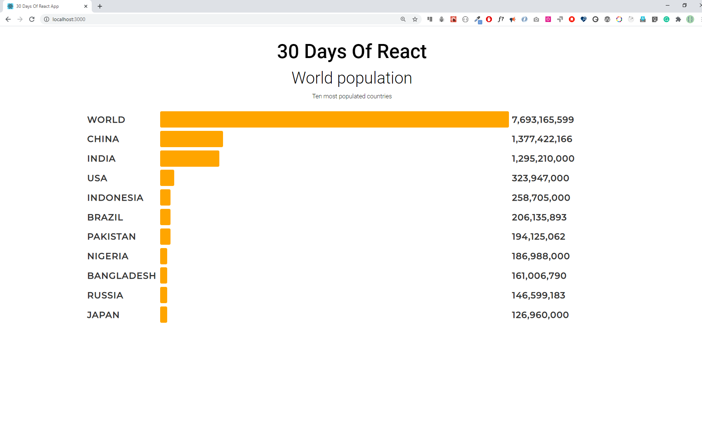

<div align="center">
  <h1> 30 Days Of React: Mapping Arrays </h1>
  <a class="header-badge" target="_blank" href="https://www.linkedin.com/in/asabeneh/">
  
  </a>
  <a class="header-badge" target="_blank" href="https://twitter.com/Asabeneh">
  
  </a>

<sub>Author:
<a href="https://www.linkedin.com/in/asabeneh/" target="_blank">Asabeneh Yetayeh</a><br>
<small> October, 2020</small>
</sub>

</div>

[<< Day 5](./../05_Day_Props/05_props.md) | [Day 7 >>]()


- [Mapping arrays](#mapping-arrays)
  - [Mapping and rendering arrays](#mapping-and-rendering-arrays)
    - [Mapping array of numbers](#mapping-array-of-numbers)
    - [Mapping array of arrays](#mapping-array-of-arrays)
    - [Mapping array of objects](#mapping-array-of-objects)
    - [Key in mapping arrays](#key-in-mapping-arrays)
- [Exercises](#exercises)

# Mapping arrays

Array is the most frequently used data structure to handle many kind of problems. In React, we use map to modify an array to list of JSX by adding a certain HTML elements to each element of the array.

## Mapping and rendering arrays

Most of the time data is in the form of array or array of objects. To render this array or array of objects most of the time we modify the data using _map_. In the previous section, we have rendered the techs list using map. In this section also we will also see more examples.

In the following examples, you will see how we render a number array, a string array, a countries array and skills array on the browser.

```js
import React from 'react'
import ReactDOM from 'react-dom'
const App = () => {
  return (
    <div className='container'>
      <div>
        <h1>Numbers List</h1>
        {[1, 2, 3, 4, 5]}
      </div>
    </div>
  )
}

const rootElement = document.getElementById('root')
ReactDOM.render(<App />, rootElement)
```

If you check the browser, you will see the numbers are attached together in one line. To avoid this, we modify the array and change the array elements to JSX element. See the example below, the array has been modified to a list JSX elements.

### Mapping array of numbers

```js
import React from 'react'
import ReactDOM from 'react-dom'

const Numbers = ({ numbers }) => {
  // modifying array to array of li JSX
  const list = numbers.map((number) => <li>{number}</li>)
  return list
}

// App component

const App = () => {
  const numbers = [1, 2, 3, 4, 5]

  return (
    <div className='container'>
      <div>
        <h1>Numbers List</h1>
        <ul>
          <Numbers numbers={numbers} />
        </ul>
      </div>
    </div>
  )
}

const rootElement = document.getElementById('root')
ReactDOM.render(<App />, rootElement)
```

### Mapping array of arrays

Let's see how to map array of arrays

```js
import React from 'react'
import ReactDOM from 'react-dom'

  const skills = [
    ['HTML', 10],
    ['CSS', 7],
    ['JavaScript', 9],
    ['React', 8],
  ]

  // Skill Component
  const Skill = ({ skill: [tech, level] }) => (
    <li>
      {tech} {level}
    </li>
  )

  // Skills Component
  const Skills = ({ skills }) => {
    const skillsList = skills.map((skill) => <Skill skill={skill} />)
    console.log(skillsList)
    return <ul>{skillsList}</ul>
  }

  const App = () => {
      return (
    <div className='container'>
      <div>
        <h1>Skills Level</h1>
        <Skills skills={skills} />
      </div>
    </div>
  )
  }

const rootElement = document.getElementById('root')
ReactDOM.render(<App />, rootElement)
```

### Mapping array of objects

Rendering array of objects

```js
import React from 'react'
import ReactDOM from 'react-dom'

const countries = [
  { name: 'Finland', city: 'Helsinki' },
  { name: 'Sweden', city: 'Stockholm' },
  { name: 'Denmark', city: 'Copenhagen' },
  { name: 'Norway', city: 'Oslo' },
  { name: 'Iceland', city: 'Reykjavík' },
]

// Country component
const Country = ({ country: { name, city } }) => {
  return (
    <div>
      <h1>{name}</h1>
      <small>{city}</small>
    </div>
  )
}

// countries component
const Countries = ({ countries }) => {
  const countryList = countries.map((country) => <Country country={country} />)
  return <div>{countryList}</div>
}
// App component
const App = () => (
  <div className='container'>
    <div>
      <h1>Countries List</h1>
      <Countries countries={countries} />
    </div>
  </div>
)

const rootElement = document.getElementById('root')
ReactDOM.render(<App />, rootElement)
```

### Key in mapping arrays

Keys help React identify which items have changed, are added, or are removed. Keys should be given to the elements inside the array to give the elements a stable identity. Key should be unique. Mostly data has come with an id and we can use id as key. If we do not pass key react raise a warning on the browser. If the data does not have id we have to find a way to create a unique identifier for each elements when we map it. See the following example:

```js
import React from 'react'
import ReactDOM from 'react-dom'

const Numbers = ({ numbers }) => {
  // modifying array to array of li JSX
  const list = numbers.map((num) => <li key={num}>{num}</li>)
  return list
}

const App = () => {
  const numbers = [1, 2, 3, 4, 5]

  return (
    <div className='container'>
      <div>
        <h1>Numbers List</h1>
        <ul>
          <Numbers numbers={numbers} />
        </ul>
      </div>
    </div>
  )
}

const rootElement = document.getElementById('root')
ReactDOM.render(<App />, rootElement)
```

Let's also add in key in countries mapping example.

```js
import React from 'react'
import ReactDOM from 'react-dom'

const countries = [
  { name: 'Finland', city: 'Helsinki' },
  { name: 'Sweden', city: 'Stockholm' },
  { name: 'Denmark', city: 'Copenhagen' },
  { name: 'Norway', city: 'Oslo' },
  { name: 'Iceland', city: 'Reykjavík' },
]

// Country component
const Country = ({ country: { name, city } }) => {
  return (
    <div>
      <h1>{name}</h1>
      <small>{city}</small>
    </div>
  )
}

// countries component
const Countries = ({ countries }) => {
  const countryList = countries.map((country) => (
    <Country key={country.name} country={country} />
  ))
  return <div>{countryList}</div>
}
const App = () => (
  <div className='container'>
    <div>
      <h1>Countries List</h1>
      <Countries countries={countries} />
    </div>
  </div>
)

const rootElement = document.getElementById('root')
ReactDOM.render(<App />, rootElement)
```

# Exercises

1. In the following design, evens are green, odds are yellow and prime numbers are red.


2. Create the following hexadecimal colors


3. 

🎉 CONGRATULATIONS ! 🎉

[<< Day 5](./../05_Day_Props/05_props.md) | [Day 7 >>]()
