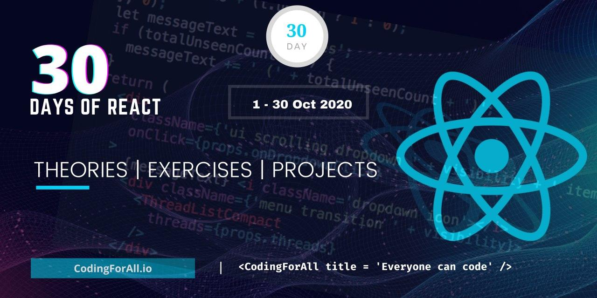

  <h1> 30 Days Of React: Conclusions</h1>
  
  

Author:
<a href="https://www.linkedin.com/in/asabeneh/" target="_blank">Asabeneh Yetayeh</a> 
<small> October, 2020</small>

[<< Day 29](../29_explore/29_explore.md)

# Conclusions

In this challenge, we have covered React with and without hooks. All the most important features of React has been included. If you did all the exercises and projects in this challenge I would say your React and JavaScript level is very high. You are ready for developer positions. This challenge was made in this month and it will be updated and improved in the coming months. We will correct grammar and typo mistakes. Some content might be added, the pending exercises in some days challenge will be included. It is good to check it at some point, because there might be some interesting projects.
You have been learning and coding for the last 30 days and you made it to this day. You are a special person and you deserve recognition. Therefore, you can claim a 30 Days React challenge completion certificate. In addition, celebrate your success with a friend and family. I will see you in another challenge or courses. Thank you for being a proactive community member and part of the challenge. Finally, recommend the material for a family, friend or enemy if you believe that it helped you and of course support the author to create more learning materials.

# Exercises

🎉 CONGRATULATIONS ! 🎉

[<< Day 29](../29_explore/29_explore.md)
