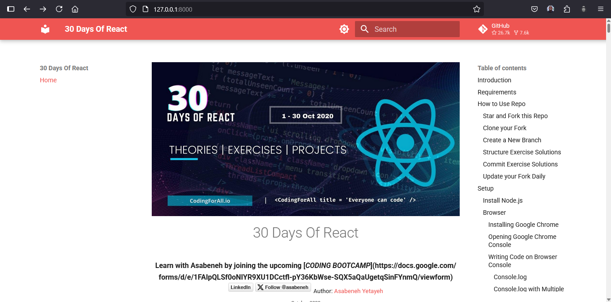

# 30 Days Of React

Offline access for the 30 days of React learning challenge.


This project provides offline access to the "30 Days of React" learning challenge using MkDocs for documentation serving.

## Requirements

- Python 3.6 or higher
- [pip](https://pip.pypa.io/en/stable/installation/)

## Getting Started

### 1. Clone the repository
```sh
git clone https://github.com/Asabeneh/30-Days-Of-React.git
cd 30-Days-Of-React
```

### 2. Set up a virtual environment (recommended)
```sh
python -m venv .venv
source .venv/bin/activate  # On Windows use `.venv\Scripts\activate`
```

### 3. Install MkDocs
```sh
pip install mkdocs mkdocs-material
```

### 4. Serve the documentation
```sh
mkdocs serve
```

This will start a local server (usually at http://127.0.0.1:8000/) where you can browse the documentation offline.

## Virtual Environment Management

### Option A: Manual Activation (Default)
If you're using a virtual environment manually, you **must** activate it every time you start a new terminal session:

```sh
source .venv/bin/activate  # ✅ Required before running mkdocs serve
mkdocs serve
```

### Option B: Automatic Virtual Environment Activation (Advanced Users)
**This section is only for users who want automatic virtual environment activation using direnv.**

If you prefer automatic activation when entering the project directory, you can use [direnv](https://direnv.net/):

#### Setup direnv (one-time installation):
```sh
# Ubuntu/Debian
sudo apt install direnv

# macOS
brew install direnv

# Add to your shell profile (~/.bashrc, ~/.zshrc, etc.)
eval "$(direnv hook bash)"  # for bash
eval "$(direnv hook zsh)"   # for zsh
```

#### Configure automatic activation for this project:
```sh
# In your project directory
echo "source .venv/bin/activate" > .envrc
direnv allow
```

After this setup, your virtual environment will automatically activate when you `cd` into the project directory.

## Additional Notes

- All course content is located in the `docs/` folder
- Configuration settings can be found in `mkdocs.yml`
- The virtual environment folder is named `.venv` to follow Python conventions

## Troubleshooting

- If `mkdocs serve` fails, ensure your virtual environment is activated and dependencies are installed
- On Windows, use backslashes for paths: `.venv\Scripts\activate`
- If you encounter permission issues with direnv, make sure it's properly integrated with your shell

Happy learning! 🚀