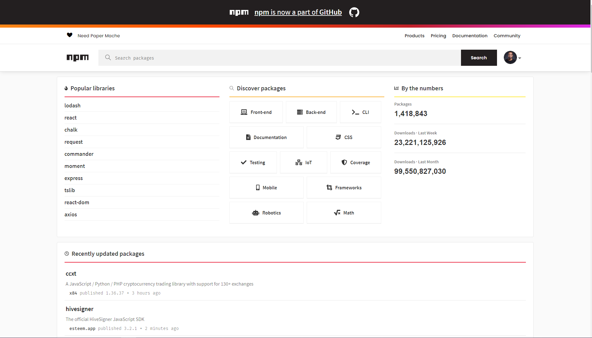

<div align="center">
  <h1> 30 Days Of React:Third Party Packages</h1>
  <a class="header-badge" target="_blank" href="https://www.linkedin.com/in/asabeneh/">
  
  </a>
  <a class="header-badge" target="_blank" href="https://twitter.com/Asabeneh">
  
  </a>

<sub>Author:
<a href="https://www.linkedin.com/in/asabeneh/" target="_blank">Asabeneh Yetayeh</a><br>
<small> October, 2020</small>
</sub>

</div>

[<< Day 14](../14_Day_Component_Life_Cycles/14_component_life_cycles.md) | [Day 16 >>](../16_Higher_Order_Component/16_higher_order_component.md)


- [Third Party Packages](#third-party-packages)
  - [NPM or Yarn](#npm-or-yarn)
    - [node-sass](#node-sass)
    - [CSS modules](#css-modules)
    - [axios](#axios)
    - [react-icons](#react-icons)
    - [moment](#moment)
    - [styled-components](#styled-components)
    - [reactstrap](#reactstrap)
    - [lodash](#lodash)
- [Exercises](#exercises)
  - [Exercises: Level 1](#exercises-level-1)
  - [Exercises: Level 2](#exercises-level-2)
  - [Exercises: Level 3](#exercises-level-3)

# Third Party Packages

There are more than 1.4M JavaScript packages on npm registry. By now there is a package almost for every kind of problem. We do not have to create the wheel instead we have to know how to use the wheel. In this section, we will learn how to use npm packages and also we will implement most common package for React applications. As of October 10, 2020, the npm registry popular packages, total number of packages, downloads per week and downloads per month seems as shown below.



In one way or the other you many need the following packages in your React applications. Specially node-sass, moment and axios are important for some projects.

- [node-sass](https://www.npmjs.com/package/node-sass)
- [moment](https://www.npmjs.com/package/moment)
- [axios](https://www.npmjs.com/package/axios)
- [react-icons](https://react-icons.github.io/react-icons/)
- [styled-components](https://styled-components.com/)
- [reactstrap](https://reactstrap.github.io/)
- [lodash](https://www.npmjs.com/package/lodash)
- [uuid](https://www.npmjs.com/package/uuid)

## NPM or Yarn

You can use either npm or yarn to install packages. If you want to use [yarn](https://yarnpkg.com) you have install it separately. I would recommend you to stick in one of the package. Don't use both package management tools in one application at the same time.

Let's see how to install packages to an application. First, we go to the project directory and write the following command.

```sh
// syntax, we can use i or install
npm i package-name
// or
yarn add package-name
```

### node-sass

Sass is a CSS preprocess which allows to write CSS function, nesting and many more. Let's install node-sass to make use of the power of Sass.

Using npm:

```sh
Asabeneh@DESKTOP-KGC1AKC MINGW64 ~/Desktop/30-days-of-react$ npm install node-sass
```

Using yarn:

```sh
Asabeneh@DESKTOP-KGC1AKC MINGW64 ~/Desktop/30-days-of-react$ yarn add node-sass
```

After installing node-sass you can start using Sass in React. Create a styles folder and inside this folder create test.scss. Import this file to the component you are working or index.js. You don't need import the node-sass to the component.

```css
/* ./styles/header.scss */
header {
  background-color: #61dbfb;
  padding: 25;
  padding: 10px;
  margin: 0;
}
```

```js
// Header.js
import React from 'react'
import './styles/header.scss
const Header = () = (
   <header>
          <div className='header-wrapper'>
            <h1>30 Days Of React</h1>
            <h2>Getting Started React</h2>
            <h3>JavaScript Library</h3>
            <p>Instructor: Asabeneh Yetayeh</p>
            <small>Oct 15, 2020</small>
          </div>
        </header>
)

export default Header
```

```js
// App.js

import React, { Component } from 'react'
import ReactDOM from 'react-dom'
import './styles/header.scss

class App extends Component {
  render() {
    return (
      <div className='App'>
       <Header />
      </div>
    )
  }
}

const rootElement = document.getElementById('root')
ReactDOM.render(<App />, rootElement)
```

### CSS modules

In addition to Sass, it is good to know how to use CSS modules in React. We do not have to install a separate package for a CSS module to use CSS module in React applications. CSS module can be used with Pure CSS or with Sass. The naming convention for CSS module is a specific name followed by dot and module(test.module.css or test.module.scss)

Naming:

```js
// naming for Sass
// naming for CSS
;[name].module.scss[name].module.css
```

```css
/* ./styles/header.module.scss */
.header {
  background-color: #61dbfb;
  padding: 25;
  padding: 10px;
  margin: 0;
}
.header-wrapper {
  font-weight:500
  border: 5px solid orange;
}
```

```js
// Header.js
import React from 'react'
import headerStyles from  './styles/header.module.scss
// We can all destructure the class name
const {header, headerWrapper} = headerStyles
const Header = () = (
   <header className = {headerStyles.header}>
          <div className={headerStyles.headerWrapper}>
            <h1>30 Days Of React</h1>
            <h2>Getting Started React</h2>
            <h3>JavaScript Library</h3>
            <p>Instructor: Asabeneh Yetayeh</p>
            <small>Oct 15, 2020</small>
          </div>
        </header>
)

export default Header
```

```js
// App.js

import React, { Component } from 'react'
import ReactDOM from 'react-dom'
import './styles/header.scss

class App extends Component {
  render() {
    return (
      <div className='App'>
       <Header />
      </div>
    )
  }
}

const rootElement = document.getElementById('root')
ReactDOM.render(<App />, rootElement)
```

### axios

Axios is a JavaScript library which can make HTTP requests to fetch data. In this section we will see on a get request. However, it is possible to do all the request types using [axios](https://github.com/axios/axios) (GET, POST, PUT, PATCH, DELETE).

Using npm:

```sh
Asabeneh@DESKTOP-KGC1AKC MINGW64 ~/Desktop/30-days-of-react$ npm install axios
```

Using yarn:

```sh
Asabeneh@DESKTOP-KGC1AKC MINGW64 ~/Desktop/30-days-of-react$ yarn add axios
```

```js
import React, { Component } from 'react'
// axios is a package which
// send requests to a server to fetch data
import axios from 'axios'
import ReactDOM from 'react-dom'

class App extends Component {
  state = {
    data: [],
  }
  componentDidMount() {
    const API_URL = 'https://restcountries.eu/rest/v2/all'
    axios
      .get(API_URL)
      .then((response) => {
        this.setState({
          data: response.data,
        })
      })
      .catch((error) => {
        console.log(error)
      })
  }

  renderCountries = () => {
    return this.state.data.map((country) => {
      const languageOrLanguages =
        country.languages.length > 1 ? 'Langauges' : 'Language'
      const formatLanguages = country.languages
        .map(({ name }) => name)
        .join(', ')
      return (
        <div>
          <div>
            {' '}
            {' '}
          </div>
          <div>
            <h1>{country.name}</h1>
            <p>Capital: {country.capital}</p>
            <p>
              {languageOrLanguages}: {formatLanguages}
            </p>
            <p>Population: {country.population}</p>
          </div>
        </div>
      )
    })
  }
  render() {
    return (
      <div className='App'>
        <h1>Fetching Data Using Axios</h1>
        <div>
          <p>There are {this.state.data.length} countries in the api</p>
          <div className='countries-wrapper'>{this.renderCountries()}</div>
        </div>
      </div>
    )
  }
}

const rootElement = document.getElementById('root')
ReactDOM.render(<App />, rootElement)
```

We can use axios with await and async functions. In order to implement await and async we need to have separate function outside the componentDidMount. If we implement await and async the error has to be handled by try and catch.

### react-icons

Icons are integral part of a website. To get different SVG icons

Using npm:

```sh
Asabeneh@DESKTOP-KGC1AKC MINGW64 ~/Desktop/30-days-of-react$ npm install react-icons
```

Using yarn:

```sh
Asabeneh@DESKTOP-KGC1AKC MINGW64 ~/Desktop/30-days-of-react$ yarn add react-icons
```

```js
import React, { Component } from 'react'
import axios from 'axios'
import ReactDOM from 'react-dom'
import moment from 'moment'
import {
  TiSocialLinkedinCircular,
  TiSocialGithubCircular,
  TiSocialTwitterCircular,
} from 'react-icons/ti'

const Footer = () => (
  <footer>
    <h3>30 Days Of React</h3>
    <div>
      <TiSocialLinkedinCircular />
      <TiSocialGithubCircular />
      <TiSocialTwitterCircular />
    </div>
    <div>
      <small> Copyright &copy; {new Date().getFullYear()} </small>
    </div>
  </footer>
)

class App extends Component {
  render() {
    return (
      <div className='App'>
        <h1>Welcome to the world of Icons</h1>
        <Footer />
      </div>
    )
  }
}

const rootElement = document.getElementById('root')
ReactDOM.render(<App />, rootElement)
```

### moment

Moment is a small JavaScript library which gives us different time formats.

```sh
npm install moment
```

```js
import React, { Component } from 'react'
import ReactDOM from 'react-dom'

class App extends Component {
  render() {
    return (
      <div className='App'>
        <h1>How to use moment</h1>
        <p>This challenge was started {moment('2020-10-01').fromNow()}</p>
        <p>The challenge will be over in {moment('2020-10-30').fromNow()}</p>
        <p>Today is {moment(new Date()).format('MMMM DD, YYYY HH:mm')}</p>
      </div>
    )
  }
}

const rootElement = document.getElementById('root')
ReactDOM.render(<App />, rootElement)
```

### styled-components

It uses a tagged template literals to style a component. It removes the mapping between components and styles. This means that when you're defining your styles, you're actually creating a normal React component, that has your styles attached to it.

```js
import React, { Component } from 'react'
import ReactDOM from 'react-dom'
import styled from 'styled-components'

const Title = styled.h1`
  font-size: 70px;
  font-weight: 300;
`
const Header = styled.header`
  background-color: #61dbfb;
  padding: 25;
  padding: 10px;
  margin: 0;
`

class App extends Component {
  render() {
    return (
      <div className='App'>
        <Header>
          <div>
            <Title>30 Days Of React</Title>
            <h2>Getting Started React</h2>
            <h3>JavaScript Library</h3>
            <p>Instructor: Asabeneh Yetayeh</p>
            <small>Oct 15, 2020</small>
          </div>
        </Header>
      </div>
    )
  }
}

const rootElement = document.getElementById('root')
ReactDOM.render(<App />, rootElement)
```

### reactstrap

The [reactstrap](https://reactstrap.github.io/) package allows to use a component with bootstrap.

### lodash

According to the official lodash documentation, 'A modern JavaScript utility library delivering modularity, performance & extras.'

Try to also learn how to use the package _classnames_ and _validator_.

# Exercises

## Exercises: Level 1

1. What is a package?
2. What is a third party package ?
3. Do you have to use third party packages?
4. How do you know the popularity and stability of a third party package?
5. How many JavaScript packages are there on the npm registry?
6. How do you install a third party package?
7. What packages do you use most frequently?
8. What package do you use to fetch data?
9. What is the purpose of classnames package?
10. What is the pupose validator package?

## Exercises: Level 2

1. Learn how to use Sass
2. Learn how to use axios
3. Learn how to use moment and react-icons
4. Use the validator package to validate the form you had in day 12
5. Use classnames to change a class based on some logic.

## Exercises: Level 3

🎉 CONGRATULATIONS ! 🎉

[<< Day 14](../14_Day_Component_Life_Cycles/14_component_life_cycles.md) | [Day 16 >>]()
