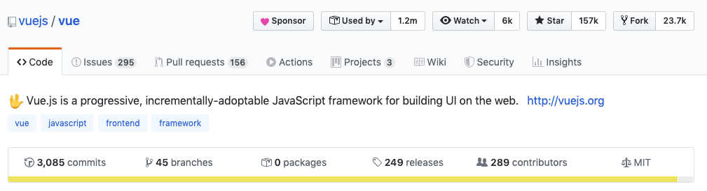
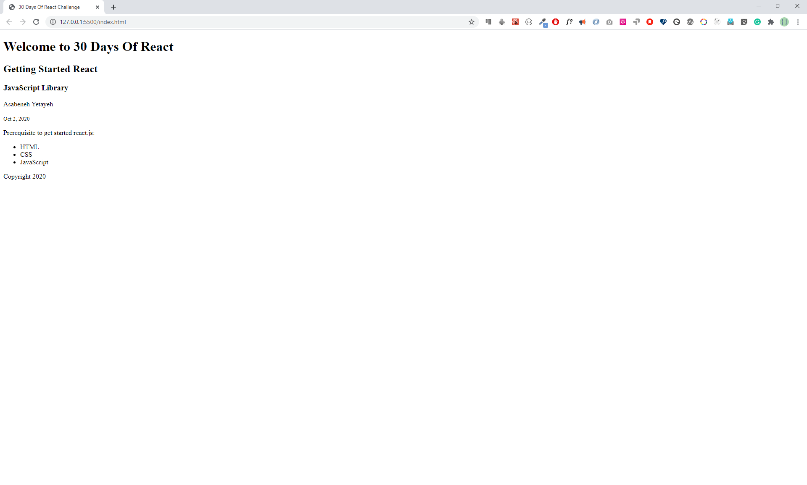
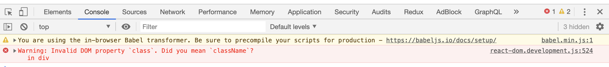
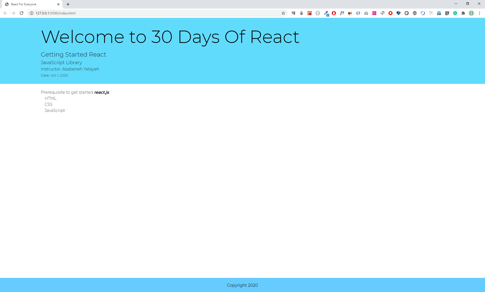
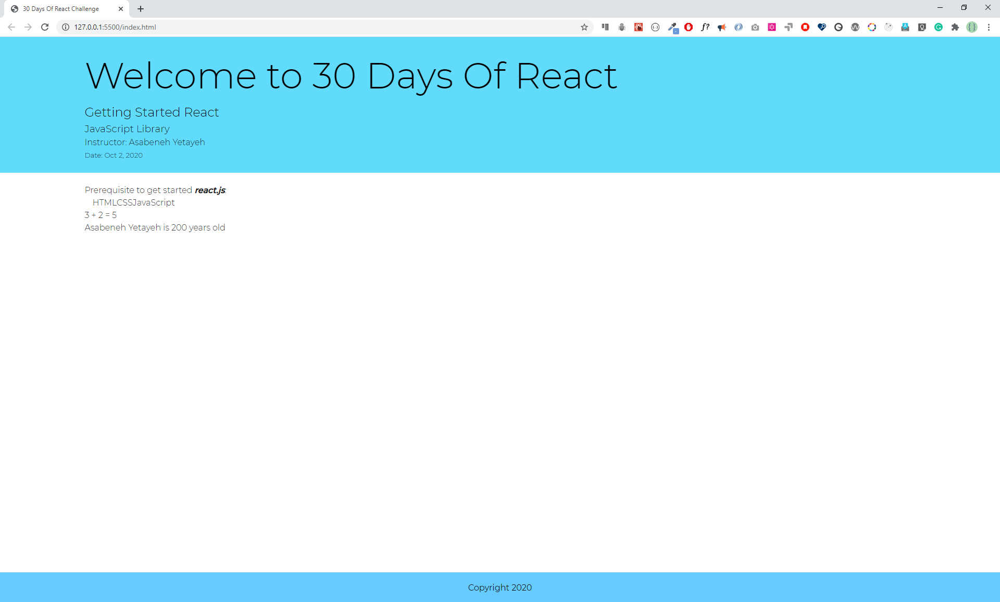
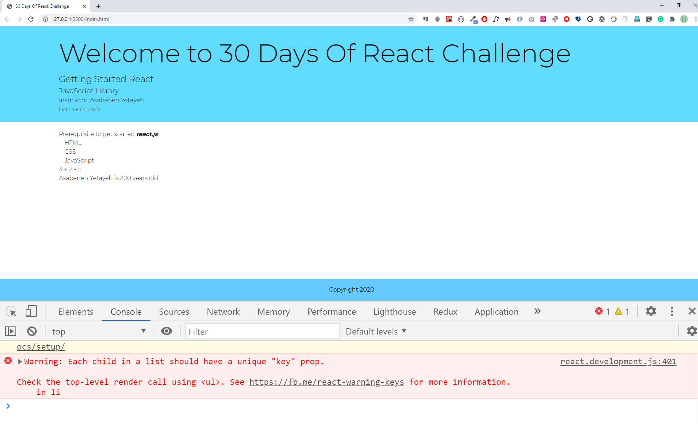

<div align="center">
  <h1> 30 Days Of React: Getting Started React</h1>
  <a class="header-badge" target="_blank" href="https://www.linkedin.com/in/asabeneh/">
  
  </a>
  <a class="header-badge" target="_blank" href="https://twitter.com/Asabeneh">
  
  </a>

<sub>Author:
<a href="https://www.linkedin.com/in/asabeneh/" target="_blank">Asabeneh Yetayeh</a><br>
<small> October, 2020</small>
</sub>

</div>

[<< Day 1](../01_Day_JavaScript_Refresher/01_javascript_refresher.md) | [Day 3 >>](../03_Day_Setting_Up/03_setting_up.md)


- [Getting Started React](#getting-started-react)
  - [1. What is React?](#1-what-is-react)
  - [2. Why React?](#2-why-react)
    - [React vs Vue popularity in October 2020](#react-vs-vue-popularity-in-october-2020)
    - [React vs Vue popularity in February 2020](#react-vs-vue-popularity-in-february-2020)
  - [3. JSX](#3-jsx)
    - [JSX Element](#jsx-element)
    - [Commenting a JSX element](#commenting-a-jsx-element)
    - [Rendering a JSX Element](#rendering-a-jsx-element)
    - [Style and className in JSX](#style-and-classname-in-jsx)
    - [Injecting data to a JSX Element](#injecting-data-to-a-jsx-element)
      - [Injecting a string to a JSX Element](#injecting-a-string-to-a-jsx-element)
      - [Injecting a number to a JSX Element](#injecting-a-number-to-a-jsx-element)
      - [Injecting an array to a JSX Element](#injecting-an-array-to-a-jsx-element)
      - [Injecting an object to a JSX Element](#injecting-an-object-to-a-jsx-element)
  - [Exercises](#exercises)
    - [Exercises: What is React?](#exercises-what-is-react)
    - [Exercises: Why React?](#exercises-why-react)
    - [Exercises: JSX](#exercises-jsx)
    - [Exercises: JSX Elements](#exercises-jsx-elements)
    - [Exercises: Inline Style](#exercises-inline-style)
    - [Exercises: Internal Styles](#exercises-internal-styles)
    - [Exercise: Inject data to JSX](#exercise-inject-data-to-jsx)

## Getting Started React

This section covers prerequisites to get started with React. You should have a good understanding of the following technologies:

- HTML
- CSS
- JavaScript

If you have the skills mentioned above, you will enjoy doing React. The 30 Days Of React challenge contains everything you need to know about react. In every section, it has some exercises and mini-projects, and it is recommended to work on them. This 30 Days Of React challenge will help you learn the latest version of React and the old version, step by step. The topics are broken down into 30 days, where each day contains several topics with easy-to-understand explanations, real-world examples and many hands-on exercises.
This challenge is designed for beginners and professionals who want to build a web application using React and JavaScript.
Once in a while you may need different dummy data to work with React. You can use the following [dummy data generator](https://www.30daysofreact.com/dummy-data) to generate different data.

### 1. What is React?

React is a JavaScript library for building a reusable user interface(UI). It was initially released on May 29, 2013. The current version is 16.13.1 and somehow it is stable. React was created by Facebook. React makes creating UI components very easy. The official React documentation can be found [here](https://reactjs.org/docs/getting-started.html). When we work with React we do not interact directly with the DOM. React has its own way to handle the DOM(Document Object Model) manipulation. React uses its virtual DOM to make new changes and it updates only the element, that needs changing. Do not directly interact with DOM when you build a React Application and leave the DOM manipulation job for the React virtual DOM. In this challenge, we will develop 10-15 web applications using React. A web application, or a website, is made of buttons, links, forms with different input fields, header, footer, sections, articles, texts, images, audios, videos and boxes with different shapes. We use react to make a reusable UI components of a website.

To summarize:

- React was released in May 2013
- React was created by Facebook
- React is a JavaScript library for building user interfaces
- React is used to build single page applications - An application which has only one HTML page.
- React allows us to create reusable UI components
- React latest release is 16.13.1
- [React versions](https://reactjs.org/versions/)
- React official documentation can be found [here](https://reactjs.org/docs/getting-started.html)

### 2. Why React?

React is one of the most popular JavaScript libraries. Many developers and companies have been using it for the last couple of years. Its popularity has been growing fast and it has a huge community. How do we measure popularity? One measure of popularity could be GitHub repository stars, watchers and forks. Let us compare the popularity of [React](https://github.com/facebook/react) and [Vue](https://github.com/vuejs/vue). As of today, the popularity between the two most popular JavaScript looks like as shown on the diagram. From the diagram, you can speculate the most popular JavaScript library. You may look at the number of watchers, stars and forks for both React and Vue. These alone will not be a very good measure of popularity, but still it tells a little bit about the popularity of the two technologies. If I have to recommend another JavaScript library next to React, it would be Vue.js.

#### React vs Vue popularity in October 2020

React Official GitHub Repository


Vue Official GitHub Repository


#### React vs Vue popularity in February 2020

React Official GitHub Repository


Vue Official GitHub Repository



Why we choose to use React ? We use it because of the following reasons:

- fast
- modular
- scalable
- flexible
- big community and popular
- open source
- High job opportunity

### 3. JSX

JSX stands for JavaScript XML. JSX allows us to write HTML elements with JavaScript code. An HTML element has an opening and closing tags, content, and attribute in the opening tag. However, some HTML elements may not have content and a closing tag - they are self closing elements. To create HTML elements in React we do not use the _createElement()_ instead we just use JSX elements. Therefore, JSX makes it easier to write and add HTML elements in React. JSX will be converted to JavaScript on browser using a transpiler - [babel.js](https://babeljs.io/). Babel is a library which transpiles JSX to pure JavaScript and latest JavaScript to older version. See the JSX code below.

```js
// JSX syntax
// we don't need to use quotes with JSX

const jsxElement = <h1>I am a JSX element</h1>
const welcome = <h1>Welcome to 30 Days of React Challenge</h1>
const data = <small>Oct 2, 2020</small>
```

The above strange looking code seems like JavaScript and it seems like , but it is not JavaScript and it seems like HTML but not completely an HTML element. It is a mix of JavaScript and an HTML elements. JSX can allow us to use HTML in JavaScript. The HTML element in the JSX above is _h1_ and _small_.

#### JSX Element

As you have seen in the example above, JSX has a JavaScript and HTML like syntax. JSX element could be a single HTML element or many HTML elements wrapped in a parent HTML element.

This JSX element has only one HTML element which is _h1_.

```js
const jsxElement = <h1>I am a JSX element</h1> // JS with HTML
```

Let's make more JSX elements by declaring a new variable named title and content inside _h2_.

```js
const title = <h2>Getting Started React</h2>
```

Let us add a subtitles and other contents to this JSX element by adding additional HTML elements. Every HTML element should be wrapped by an outer HTML element to create a valid JSX element. The name title variable also should be changed to header because our JSX element is containing almost all of the header of the application.

```js
const header = (
  <header>
    <h1>Welcome to 30 Days Of React</h1>
    <h2>Getting Started React</h2>
    <h3>JavaScript Library</h3>
  </header>
)
```

Let us keep adding more elements. Additional HTML elements to display the author name and year.

```js
const header = (
  <header>
    <h1>Welcome to 30 Days Of React</h1>
    <h2>Getting Started React</h2>
    <h3>JavaScript Library</h3>
    <p>Asabeneh Yetayeh</p>
    <small>Oct 2, 2020</small>
  </header>
)
```

As you can see the _header_ element is a parent element for all the inner HTML elements and JSX must be wrapped by an outer parent element. Without the _header_ HTML element or other parent HTML element the above JSX is invalid.

#### Commenting a JSX element

We comment codes for different reasons and it is also good to know how to comment out JSX elements in React.

```js
{
  /*
 <header>
    <h1>Welcome to 30 Days Of React</h1>
    <h2>Getting Started React</h2>
    <h3>JavaScript Library</h3>
    <p>Asabeneh Yetayeh</p>
    <small>Oct 2, 2020</small>
  </header>

*/
}
```

#### Rendering a JSX Element

To render a JSX element to HTML document, we should first create an index HTML. The index.html is the only HTML file you will have in any React Application. That is why we say that every React Application is a single page application. Let us create an index.html file. We can get started with React in two ways - either by using CDN or create-react-app. The create-react-app creates a React project boilerplate outbox and because of that, many people do have a hard time to understand how React works. In order to make things clear for absolute beginners I would like to start with a CDN. We use CDN only in this section and we will use the create-reap-app in the rest of the challenge and I also recommend you to use only create-react-app all the time.

```html
<!DOCTYPE html>
<html lang="en">
  <head>
    <meta charset="UTF-8" />
    <meta name="viewport" content="width=device-width, initial-scale=1.0" />
    <title>30 Days Of React Challenge</title>
  </head>

  <body>
    <div class="root"></div>

    <script></script>
  </body>
</html>
```

As you can see from the above index.html, we have one div with a class root and script. The root _div_ is the gateway to connect all react components to the index.html. In the script tag we will write our JavaScript, but the script _type_ will be _babel_. Babel will _transpile_ the react JSX to pure JavaScript on the browser. Let us add babel to the script. Inside the babel, we can write any pure JavaScript, JSX and in general any React code.

```html
<!DOCTYPE html>
<html lang="en">
  <head>
    <meta charset="UTF-8" />
    <meta name="viewport" content="width=device-width, initial-scale=1.0" />
    <title>30 Days Of React Challenge</title>
  </head>

  <body>
    <div class="root"></div>
    <script src="https://unpkg.com/@babel/standalone/babel.min.js"></script>
    <script type="text/babel">
      // our code goes here
    </script>
  </body>
</html>
```

The babel library is linked to our document and now we can make use of it. The next step is importing _React_ and _ReactDOM_ using CDN or link. In order to link React and ReactDOM, we attach both packages from CDN to the body of index.html. To test if React is linked to the index.html, try to check it by doing console.log(React). Open the browser console and you should get an object. If you see an object containing React methods then you managed to link your project with React CDN and you are ready to use React.

```html
<!DOCTYPE html>
<html lang="en">
  <head>
    <meta charset="UTF-8" />
    <meta name="viewport" content="width=device-width, initial-scale=1.0" />
    <title>30 Days Of React Challenge</title>
  </head>

  <body>
    <div class="root"></div>

    <script
      crossorigin
      src="https://unpkg.com/react@16/umd/react.development.js"
    ></script>
    <script
      crossorigin
      src="https://unpkg.com/react-dom@16/umd/react-dom.development.js"
    ></script>
    <script src="https://unpkg.com/@babel/standalone/babel.min.js"></script>
    <script type="text/babel">
      console.log(React)
    </script>
  </body>
</html>
```

Now the index.html has everything we need to write React code. Let us get the root element using document.querySelect('.root') and assign it to a variable name rootElement. The is the only place we directly interact with DOM.

Now, you knew JSX and JSX element. Let us render the JSX element on the browser, in order to do so we need the React and ReactDOM library. In addition to the React and ReactDOM we need babel to transpile the JSX to JavaScript code. The ReactDOM package has a method render. The render method takes two arguments:a JSX element or a component and the root document. See the code below. [Live on code pen](https://codepen.io/Asabeneh/full/JjdbjqK).

```html
<!DOCTYPE html>
<html lang="en">
  <head>
    <meta charset="UTF-8" />
    <meta name="viewport" content="width=device-width, initial-scale=1.0" />
    <title>30 Days Of React Challenge</title>
  </head>

  <body>
    <div class="root"></div>

    <script
      crossorigin
      src="https://unpkg.com/react@16/umd/react.development.js"
    ></script>
    <script
      crossorigin
      src="https://unpkg.com/react-dom@16/umd/react-dom.development.js"
    ></script>
    <script src="https://unpkg.com/@babel/standalone/babel.min.js"></script>
    <script type="text/babel">
      // To get the root element from the HTML document
      const rootElement = document.querySelector('.root')

      // JSX element
      const jsxElement = <h1>I am a JSX element</h1>

      // we render the JSX element using the ReactDOM package
      // ReactDOM has the render method and the render method takes two arguments
      ReactDOM.render(jsxElement, rootElement)
    </script>
  </body>
</html>
```


Let us render more content. To render more content, the JSX element should have more HTML elements. For instance, we can create a header of a website and header may have a title, subtitle, author or date etc. Remember, we can render only one JSX element at a time.
[Live on code pen](https://codepen.io/Asabeneh/full/QWbGWeY).

```html
<!DOCTYPE html>
<html lang="en">
  <head>
    <meta charset="UTF-8" />
    <meta name="viewport" content="width=device-width, initial-scale=1.0" />
    <title>30 Days Of React Challenge</title>
  </head>

  <body>
    <div class="root"></div>

    <script
      crossorigin
      src="https://unpkg.com/react@16/umd/react.development.js"
    ></script>
    <script
      crossorigin
      src="https://unpkg.com/react-dom@16/umd/react-dom.development.js"
    ></script>
    <script src="https://unpkg.com/@babel/standalone/babel.min.js"></script>
    <script type="text/babel">
      // To get the root element from the HTML document
      const rootElement = document.querySelector('.root')

      // JSX element
      const header = (
        <header>
          <h1>Welcome to 30 Days Of React</h1>
          <h2>Getting Started React</h2>
          <h3>JavaScript Library</h3>
          <p>Asabeneh Yetayeh</p>
          <small>Oct 2, 2020</small>
        </header>
      )

      // we render the JSX element using the ReactDOM package
      // ReactDOM has the render method and the render method takes two arguments
      ReactDOM.render(header, rootElement)
    </script>
  </body>
</html>
```


We have created a JSX element for the header of the website. How about the main and the footer for the website? Similar to the header, let us create a JSX element for the main and the footer.

JSX element for the main part of the website.

```js
// JSX element
const main = (
  <main>
    <p>Prerequisite to get started react.js:</p>
    <ul>
      <li>HTML</li>
      <li>CSS</li>
      <li>JavaScript</li>
    </ul>
  </main>
)
```

JSX element for the footer part of the website.

```js
// JSX element
const footer = (
  <footer>
    <p>Copyright 2020</p>
  </footer>
)
```

Now, we have three JSX elements: the header, main and footer. The best way to render all of the three JSX elements is by wrapping them all in a parent JSX element or putting them in an array. To include JSX element inside another JSX element we use the curly bracket, {} and call the name of the JSX inside the curly bracket.

```js
// JSX element for the header part of the website
const header = (
  <header>
    <h1>Welcome to 30 Days Of React</h1>
    <h2>Getting Started React</h2>
    <h3>JavaScript Library</h3>
    <p>Asabeneh Yetayeh</p>
    <small>Oct 2, 2020</small>
  </header>
)

// JSX element for the main part of the website
const main = (
  <main>
    <p>Prerequisite to get started react.js:</p>
    <ul>
      <li>HTML</li>
      <li>CSS</li>
      <li>JavaScript</li>
    </ul>
  </main>
)

// JSX element for the footer part of the website
const footer = (
  <footer>
    <p>Copyright 2020</p>
  </footer>
)

// JSX element which contain all, it is a container or parent
const app = (
  <div>
    {header}
    {main}
    {footer}
  </div>
)
```

Now, let us put everything together and render it to the browser. [Live on code pen](https://codepen.io/Asabeneh/full/MWwbYWg).

```html
<!DOCTYPE html>
<html lang="en">
  <head>
    <meta charset="UTF-8" />
    <meta name="viewport" content="width=device-width, initial-scale=1.0" />
    <title>30 Days Of React Challenge</title>
  </head>

  <body>
    <div class="root"></div>

    <script
      crossorigin
      src="https://unpkg.com/react@16/umd/react.development.js"
    ></script>
    <script
      crossorigin
      src="https://unpkg.com/react-dom@16/umd/react-dom.development.js"
    ></script>
    <script src="https://unpkg.com/@babel/standalone/babel.min.js"></script>
    <script type="text/babel">
      // To get the root element from the HTML document
      const rootElement = document.querySelector('.root')

      // JSX element, header
      const header = (
        <header>
          <h1>Welcome to 30 Days Of React</h1>
          <h2>Getting Started React</h2>
          <h3>JavaScript Library</h3>
          <p>Asabeneh Yetayeh</p>
          <small>Oct 2, 2020</small>
        </header>
      )

      // JSX element, main
      const main = (
        <main>
          <p>Prerequisite to get started react.js:</p>
          <ul>
            <li>HTML</li>
            <li>CSS</li>
            <li>JavaScript</li>
          </ul>
        </main>
      )

      // JSX element, footer
      const footer = (
        <footer>
          <p>Copyright 2020</p>
        </footer>
      )

      // JSX element, app, a container or a parent
      const app = (
        <div>
          {header}
          {main}
          {footer}
        </div>
      )

      // we render the JSX element using the ReactDOM package
      // ReactDOM has the render method and the render method takes two argument
      ReactDOM.render(app, rootElement)
      // or
      //  ReactDOM.render([header, main, footer], rootElement)
    </script>
  </body>
</html>
```



Let us apply some style to our JSX elements and see the result.

.

Now, lets us apply style the header part only [Live on code pen](https://codepen.io/Asabeneh/full/ZEGBYBG).

#### Style and className in JSX

So far, we did not apply any style in the JSX elements. Now, let us add style to our JSX elements. Inline style became very popular after the emergence of react. Let us add border to the header JSX element.

To add style to a JSX element we use inline style or className. We inject the style object using {}. Every CSS property becomes a key and every CSS property value becomes a value for the the object. For instance, in the example below, border is a key and '2px solid orange' is a value, color is a key and 'black' is a value, fontSize is a key and '18px' is a value. All two word CSS properties will change to camelCase when we use them as key in the CSS object in React or JavaScript.[Live on code pen](https://codepen.io/Asabeneh/full/ZEGBYbY).

```js
const header = (
  <header
    style={{ border: '2px solid orange', color: 'black', fontSize: '18px' }}
  >
    <h1>Welcome to 30 Days Of React</h1>
    <h2>Getting Started React</h2>
    <h3>JavaScript Library</h3>
    <p>Asabeneh Yetayeh</p>
    <small>Oct 2, 2020</small>
  </header>
)

// or we can write it this way

const style = { border: '2px solid orange', color: 'black', fontSize: '18px' }

const header = (
  <header style={style}>
    <h1>Welcome to 30 Days Of React</h1>
    <h2>Getting Started React</h2>
    <h3>JavaScript Library</h3>
    <p>Asabeneh Yetayeh</p>
    <small>Oct 2, 2020</small>
  </header>
)
```

It is good practice to open the browser console while you are developing your application to know, if everything goes well.

Let us keep styling all the JSX elements we have created: the header, main and the footer. We can also use regular internal styling to style our application. Using regular style, to target an HTML element we use tag name, id, class, an attribute and other methods. It is very common in the React developer community - people use classes quite a lot instead of id. In this material, I will use only class instead of id.

In JSX element we write className instead of class because class is a reserved word in JavaScript. Similar to className, htmlFor instead of for in label tag. See the example below.

```js
const title = <h1 className='title'>Getting Started React</h1>
const inputField = (
  <div>
    <label htmlFor='firstname'>First Name</label>
    <input type='text' id='firstname' placeholder='First Name' />
  </div>
)
```

The id used in the input element is not for styling purpose, instead to refer the label to the input field.

If class is used instead of className or for instead of htmlFor you will see such kind of warning.



Now, you know how to use the inline style and how to use className. Let us style all the JSX elements.

```html
<!DOCTYPE html>
<html lang="en">
  <head>
    <meta charset="UTF-8" />
    <meta name="viewport" content="width=device-width, initial-scale=1.0" />
    <title>30 Days Of React Challenge</title>
  </head>

  <body>
    <div class="root"></div>

    <script
      crossorigin
      src="https://unpkg.com/react@16/umd/react.development.js"
    ></script>
    <script
      crossorigin
      src="https://unpkg.com/react-dom@16/umd/react-dom.development.js"
    ></script>
    <script src="https://unpkg.com/@babel/standalone/babel.min.js"></script>
    <script type="text/babel">
      // To get the root element from the HTML document
      const rootElement = document.querySelector('.root')

      // style
      const headerStyles = {
        backgroundColor: '#61DBFB',
        fontFamily: 'Helvetica Neue',
        padding: 25,
        lineHeight: 1.5,
      }

      // JSX element, header
      const header = (
        <header style={headerStyles}>
          <div className='header-wrapper'>
            <h1>Welcome to 30 Days Of React</h1>
            <h2>Getting Started React</h2>
            <h3>JavaScript Library</h3>
            <p>Asabeneh Yetayeh</p>
            <small>Oct 2, 2020</small>
          </div>
        </header>
      )

      // JSX element, main
      const mainStyles = {
        backgroundColor: '#F3F0F5',
      }
      const main = (
        <main style={mainStyles}>
          <p>Prerequisite to get started react.js:</p>
          <ul>
            <li>HTML</li>
            <li>CSS</li>
            <li>JavaScript</li>
          </ul>
        </main>
      )

      const footerStyles = {
        backgroundColor: '#61DBFB',
      }
      // JSX element, footer
      const footer = (
        <footer style={footerStyles}>
          <p>Copyright 2020</p>
        </footer>
      )

      // JSX element, app
      const app = (
        <div className='app'>
          {header}
          {main}
          {footer}
        </div>
      )

      // we render the JSX element using the ReactDOM package
      ReactDOM.render(app, rootElement)
    </script>
  </body>
</html>
```


Instead of style object using regular styling method is more easy than the one above. Now, let us use internal style to style all the JSX. It is also possible to use external styling method. [Live on code pen](https://codepen.io/Asabeneh/full/QWbGwge)

```html
<!DOCTYPE html>
<html lang="en">
  <head>
    <meta charset="UTF-8" />
    <meta name="viewport" content="width=device-width, initial-scale=1.0" />
    <link
      href="https://fonts.googleapis.com/css?family=Montserrat:300,400,500|Roboto:300,400,500&display=swap"
      rel="stylesheet"
    />

    <title>30 Days Of React Challenge</title>
    <style>
      /* == General style === */
      * {
        box-sizing: border-box;
        padding: 0;
        margin: 0;
      }

      html,
      body {
        height: 100%;
        line-height: 1.5;
        font-family: 'Montserrat';
        font-weight: 300;
        color: black;
      }

      .root {
        min-height: 100%;
        position: relative;
      }

      .header-wrapper,
      .main-wrapper,
      .footer-wrapper {
        width: 85%;
        margin: auto;
      }

      .header-wrapper,
      .main-wrapper {
        padding: 10px;
        margin: 2px auto;
      }

      h1 {
        font-size: 70px;
        font-weight: 300;
      }

      h2,
      h3 {
        font-weight: 300;
      }

      header {
        background-color: #61dbfb;
        padding: 10px;
      }

      main {
        padding: 10px;
        padding-bottom: 60px;
        /* Height of the footer */
      }

      ul {
        margin-left: 15px;
      }

      ul li {
        list-style: none;
      }

      footer {
        position: absolute;
        bottom: 0;
        width: 100%;
        height: 60px;
        /* Height of the footer */
        background: #6cf;
      }

      .footer-wrapper {
        font-weight: 400;
        text-align: center;
        line-height: 60px;
      }
    </style>
  </head>

  <body>
    <div class="root"></div>

    <script
      crossorigin
      src="https://unpkg.com/react@16/umd/react.development.js"
    ></script>
    <script
      crossorigin
      src="https://unpkg.com/react-dom@16/umd/react-dom.development.js"
    ></script>
    <script src="https://unpkg.com/@babel/standalone/babel.min.js"></script>
    <script type="text/babel">
      // To get the root element from the HTML document
      const rootElement = document.querySelector('.root')

      // JSX element, header
      const header = (
        <header>
          <div className='header-wrapper'>
            <h1>Welcome to 30 Days Of React</h1>
            <h2>Getting Started React</h2>
            <h3>JavaScript Library</h3>
            <p>Instructor: Asabeneh Yetayeh</p>
            <small>Date: Oct 1, 2020</small>
          </div>
        </header>
      )

      // JSX element, main
      const main = (
        <main>
          <div className='main-wrapper'>
            <p>
              Prerequisite to get started{' '}
              <strong>
                <em>react.js</em>
              </strong>
              :
            </p>
            <ul>
              <li>HTML</li>
              <li>CSS</li>
              <li> JavaScript</li>
            </ul>
          </div>
        </main>
      )

      // JSX element, footer
      const footer = (
        <footer>
          <div className='footer-wrapper'>
            <p>Copyright 2020</p>
          </div>
        </footer>
      )

      // JSX element, app
      const app = (
        <div className='app'>
          {header}
          {main}
          {footer}
        </div>
      )

      // we render the JSX element using the ReactDOM package
      ReactDOM.render(app, rootElement)
    </script>
  </body>
</html>
```



#### Injecting data to a JSX Element

So far, we used static data on the JSX elements, but we can also pass different data types as a dynamic data. The dynamic data could be string, number, boolean, array or object. Let us see each of the data types step by step. To inject data to a JSX we use the {} bracket.

```js
const welcome = 'Welcome to 30 Days Of React'
const title = 'Getting Started React'
const subtitle = 'JavaScript Library'
const authorFirstName = 'Asabeneh'
const authorLastName = 'Yetayeh'
const date = 'Oct 1, 2020'

// JSX element, header
const header = (
  <header>
    <div className='header-wrapper'>
      <h1>{welcome}</h1>
      <h2>{title}</h2>
      <h3>{subtitle}</h3>
      <p>
        Instructor: {authorFirstName} {authorLastName}
      </p>
      <small>Date: {date}</small>
    </div>
  </header>
)
```

Similar to the header JSX element, we can implement data injection to main and footer JSX elements.

##### Injecting a string to a JSX Element

In this section we inject only strings

```js
const welcome = 'Welcome to 30 Days Of React'
const title = 'Getting Started React'
const subtitle = 'JavaScript Library'
const firstName = 'Asabeneh'
const lastName = 'Yetayeh'
const date = 'Oct 2, 2020'

// JSX element, header

// JSX element, header
const header = (
  <header>
    <div className='header-wrapper'>
      <h1>{welcome}</h1>
      <h2>{title}</h2>
      <h3>{subtitle}</h3>
      <p>
        Instructor: {firstName} {lastName}
      </p>
      <small>Date: {date}</small>
    </div>
  </header>
)
```

##### Injecting a number to a JSX Element

```js
const numOne = 3
const numTwo = 2

const result = (
  <p>
    {numOne} + {numTwo} = {numOne + numTwo}
  </p>
)

const yearBorn = 1820
const currentYear = new Date().getFullYear()
const age = currentYear - yearBorn
const personAge = <p> {age}</p>
```

As you can see in the example above, it is possible to do some arithmetic calculations and ternary operations.

##### Injecting an array to a JSX Element

To give an example for an array, let us change the HTML, CSS, JavaScript to an array and inject it to the main JSX element below. We will cover more in much detail later, in rendering lists section.

```js
const techs = ['HTML', 'CSS', 'JavaScript']

// JSX element, main
const main = (
  <main>
    <div className='main-wrapper'>
      <p>
        Prerequisite to get started{' '}
        <strong>
          <em>react.js</em>
        </strong>
        :
      </p>
      <ul>{techs}</ul>
    </div>
  </main>
)
```

##### Injecting an object to a JSX Element

We can inject string, number, boolean, array data to JSX but we cannot directly inject an object. We should extract object values first or destructure the content of the object before we inject the data to the JSX element. For instance, let us write firstName and lastName inside an object and extract them to use them inside JSX.

Now, let us put everything together. Here, in the example below, the data is injected dynamically to the JSX. [Live on code pen](https://codepen.io/Asabeneh/full/YzXWgpZ)

```html
<!DOCTYPE html>
<html lang="en">
  <head>
    <meta charset="UTF-8" />
    <meta name="viewport" content="width=device-width, initial-scale=1.0" />
    <link
      href="https://fonts.googleapis.com/css?family=Montserrat:300,400,500|Roboto:300,400,500&display=swap"
      rel="stylesheet"
    />

    <title>30 Days Of React Challenge</title>
    <style>
      /* == General style === */
      * {
        box-sizing: border-box;
        padding: 0;
        margin: 0;
      }

      html,
      body {
        height: 100%;
        line-height: 1.5;
        font-family: 'Montserrat';
        font-weight: 300;
        color: black;
      }

      .root {
        min-height: 100%;
        position: relative;
      }

      .header-wrapper,
      .main-wrapper,
      .footer-wrapper {
        width: 85%;
        margin: auto;
      }

      .header-wrapper,
      .main-wrapper {
        padding: 10px;
        margin: 2px auto;
      }

      h1 {
        font-size: 70px;
        font-weight: 300;
      }

      h2,
      h3 {
        font-weight: 300;
      }

      header {
        background-color: #61dbfb;
        padding: 10px;
      }

      main {
        padding: 10px 10px 60px;
        /* Height of the footer */
      }

      ul {
        margin-left: 15px;
      }

      ul li {
        list-style: none;
      }

      footer {
        position: absolute;
        bottom: 0;
        width: 100%;
        height: 60px;
        /* Height of the footer */
        background: #6cf;
      }

      .footer-wrapper {
        font-weight: 400;
        text-align: center;
        line-height: 60px;
      }
    </style>
  </head>

  <body>
    <div class="root"></div>

    <script
      crossorigin
      src="https://unpkg.com/react@16/umd/react.development.js"
    ></script>
    <script
      crossorigin
      src="https://unpkg.com/react-dom@16/umd/react-dom.development.js"
    ></script>
    <script src="https://unpkg.com/@babel/standalone/babel.min.js"></script>
    <script type="text/babel">
      // To get the root element from the HTML document
      const rootElement = document.querySelector('.root')
      // JSX element, header
      const welcome = 'Welcome to 30 Days Of React'
      const title = 'Getting Started React'
      const subtitle = 'JavaScript Library'
      const author = {
        firstName: 'Asabeneh',
        lastName: 'Yetayeh',
      }
      const date = 'Oct 2, 2020'

      // JSX element, header
      const header = (
        <header>
          <div className='header-wrapper'>
            <h1>{welcome}</h1>
            <h2>{title}</h2>
            <h3>{subtitle}</h3>
            <p>
              Instructor: {author.firstName} {author.lastName}
            </p>
            <small>Date: {date}</small>
          </div>
        </header>
      )

      const numOne = 3
      const numTwo = 2

      const result = (
        <p>
          {numOne} + {numTwo} = {numOne + numTwo}
        </p>
      )

      const yearBorn = 1820
      const currentYear = new Date().getFullYear()
      const age = currentYear - yearBorn
      const personAge = (
        <p>
          {' '}
          {author.firstName} {author.lastName} is {age} years old
        </p>
      )

      // JSX element, main
      const techs = ['HTML', 'CSS', 'JavaScript']

      // JSX element, main
      const main = (
        <main>
          <div className='main-wrapper'>
            <p>
              Prerequisite to get started{' '}
              <strong>
                <em>react.js</em>
              </strong>
              :
            </p>
            <ul>{techs}</ul>
            {result}
            {personAge}
          </div>
        </main>
      )

      const copyRight = 'Copyright 2020'

      // JSX element, footer
      const footer = (
        <footer>
          <div className='footer-wrapper'>
            <p>{copyRight}</p>
          </div>
        </footer>
      )

      // JSX element, app
      const app = (
        <div className='app'>
          {header}
          {main}
          {footer}
        </div>
      )

      // we render the JSX element using the ReactDOM package
      ReactDOM.render(app, rootElement)
    </script>
  </body>
</html>
```



As you can see the lists are all in one line. Therefore, we should format the list the way we want, before we inject it to JSX. In order to format the list, we should modify the array before we will inject it to JSX. We can modify the array using _map_. As a react developer you should have a very good understanding of functional programming(map, filter, reduce, find, some, every). If you don't have good understanding of functional programming, check out day 1.

```js
const techs = ['HTML', 'CSS', 'JavaScript']
const techsFormatted = techs.map((tech) => <li>{tech}</li>)
```

In the following code example, the list is now containing list elements and it is formatted properly.

```html
<!DOCTYPE html>
<html lang="en">
  <head>
    <meta charset="UTF-8" />
    <meta name="viewport" content="width=device-width, initial-scale=1.0" />
    <link
      href="https://fonts.googleapis.com/css?family=Montserrat:300,400,500|Roboto:300,400,500&display=swap"
      rel="stylesheet"
    />

    <title>30 Days Of React Challenge</title>
    <style>
      /* == General style === */
      * {
        box-sizing: border-box;
        padding: 0;
        margin: 0;
      }

      html,
      body {
        height: 100%;
        line-height: 1.5;
        font-family: 'Montserrat';
        font-weight: 300;
        color: black;
      }

      .root {
        min-height: 100%;
        position: relative;
      }

      .header-wrapper,
      .main-wrapper,
      .footer-wrapper {
        width: 85%;
        margin: auto;
      }

      .header-wrapper,
      .main-wrapper {
        padding: 10px;
        margin: 2px auto;
      }

      h1 {
        font-size: 70px;
        font-weight: 300;
      }

      h2,
      h3 {
        font-weight: 300;
      }

      header {
        background-color: #61dbfb;
        padding: 10px;
      }

      main {
        padding: 10px 10px 60px;
        /* Height of the footer */
      }

      ul {
        margin-left: 15px;
      }

      ul li {
        list-style: none;
      }

      footer {
        position: absolute;
        bottom: 0;
        width: 100%;
        height: 60px;
        /* Height of the footer */
        background: #6cf;
      }

      .footer-wrapper {
        font-weight: 400;
        text-align: center;
        line-height: 60px;
      }
    </style>
  </head>

  <body>
    <div class="root"></div>

    <script
      crossorigin
      src="https://unpkg.com/react@16/umd/react.development.js"
    ></script>
    <script
      crossorigin
      src="https://unpkg.com/react-dom@16/umd/react-dom.development.js"
    ></script>
    <script src="https://unpkg.com/@babel/standalone/babel.min.js"></script>
    <script type="text/babel">
      // To get the root element from the HTML document
      const rootElement = document.querySelector('.root')
      // JSX element, header
      const welcome = 'Welcome to 30 Days Of React Challenge'
      const title = 'Getting Started React'
      const subtitle = 'JavaScript Library'
      const author = {
        firstName: 'Asabeneh',
        lastName: 'Yetayeh',
      }
      const date = 'Oct 2, 2020'

      // JSX element, header
      const header = (
        <header>
          <div className='header-wrapper'>
            <h1>{welcome}</h1>
            <h2>{title}</h2>
            <h3>{subtitle}</h3>
            <p>
              Instructor: {author.firstName} {author.lastName}
            </p>
            <small>Date: {date}</small>
          </div>
        </header>
      )

      const numOne = 3
      const numTwo = 2

      const result = (
        <p>
          {numOne} + {numTwo} = {numOne + numTwo}
        </p>
      )

      const yearBorn = 1820
      const currentYear = new Date().getFullYear()
      const age = currentYear - yearBorn
      const personAge = (
        <p>
          {' '}
          {author.firstName} {author.lastName} is {age} years old
        </p>
      )

      // JSX element, main
      const techs = ['HTML', 'CSS', 'JavaScript']
      const techsFormatted = techs.map((tech) => <li>{tech}</li>)

      // JSX element, main
      const main = (
        <main>
          <div className='main-wrapper'>
            <p>
              Prerequisite to get started{' '}
              <strong>
                <em>react.js</em>
              </strong>
              :
            </p>
            <ul>{techsFormatted}</ul>
            {result}
            {personAge}
          </div>
        </main>
      )

      const copyRight = 'Copyright 2020'

      // JSX element, footer
      const footer = (
        <footer>
          <div className='footer-wrapper'>
            <p>{copyRight}</p>
          </div>
        </footer>
      )

      // JSX element, app
      const app = (
        <div className='app'>
          {header}
          {main}
          {footer}
        </div>
      )

      // we render the JSX element using the ReactDOM package
      ReactDOM.render(app, rootElement)
    </script>
  </body>
</html>
```

Rendering lists


As you can see above, now the lists are formatted properly, but there is a warning on the console, which says each list child should have a unique key. In the array, we do not have id, but it is common to pass id as a unique value, when you have id in your data. Now, let us just pass each item with a unique key to remove the warning.

```html
<!DOCTYPE html>
<html lang="en">
  <head>
    <meta charset="UTF-8" />
    <meta name="viewport" content="width=device-width, initial-scale=1.0" />
    <link
      href="https://fonts.googleapis.com/css?family=Montserrat:300,400,500|Roboto:300,400,500&display=swap"
      rel="stylesheet"
    />

    <title>30 Days Of React Challenge</title>
    <style>
      /* == General style === */
      * {
        box-sizing: border-box;
        padding: 0;
        margin: 0;
      }

      html,
      body {
        height: 100%;
        line-height: 1.5;
        font-family: 'Montserrat';
        font-weight: 300;
        color: black;
      }

      .root {
        min-height: 100%;
        position: relative;
      }

      .header-wrapper,
      .main-wrapper,
      .footer-wrapper {
        width: 85%;
        margin: auto;
      }

      .header-wrapper,
      .main-wrapper {
        padding: 10px;
        margin: 2px auto;
      }

      h1 {
        font-size: 70px;
        font-weight: 300;
      }

      h2,
      h3 {
        font-weight: 300;
      }

      header {
        background-color: #61dbfb;
        padding: 10px;
      }

      main {
        padding: 10px;
        padding-bottom: 60px;
        /* Height of the footer */
      }

      ul {
        margin-left: 15px;
      }

      ul li {
        list-style: none;
      }

      footer {
        position: absolute;
        bottom: 0;
        width: 100%;
        height: 60px;
        /* Height of the footer */
        background: #6cf;
      }

      .footer-wrapper {
        font-weight: 400;
        text-align: center;
        line-height: 60px;
      }
    </style>
  </head>

  <body>
    <div class="root"></div>

    <script
      crossorigin
      src="https://unpkg.com/react@16/umd/react.development.js"
    ></script>
    <script
      crossorigin
      src="https://unpkg.com/react-dom@16/umd/react-dom.development.js"
    ></script>
    <script src="https://unpkg.com/@babel/standalone/babel.min.js"></script>
    <script type="text/babel">
      // To get the root element from the HTML document
      const rootElement = document.querySelector('.root')
      // JSX element, header
      const welcome = 'Welcome to 30 Days Of React Challenge'
      const title = 'Getting Started React'
      const subtitle = 'JavaScript Library'
      const author = {
        firstName: 'Asabeneh',
        lastName: 'Yetayeh',
      }
      const date = 'Oct 2, 2020'

      // JSX element, header
      const header = (
        <header>
          <div className='header-wrapper'>
            <h1>{welcome}</h1>
            <h2>{title}</h2>
            <h3>{subtitle}</h3>
            <p>
              Instructor: {author.firstName} {author.lastName}
            </p>
            <small>Date: {date}</small>
          </div>
        </header>
      )

      const numOne = 3
      const numTwo = 2

      const result = (
        <p>
          {numOne} + {numTwo} = {numOne + numTwo}
        </p>
      )

      const yearBorn = 1820
      const currentYear = 2020
      const age = currentYear - yearBorn
      const personAge = (
        <p>
          {' '}
          {author.firstName} {author.lastName} is {age} years old
        </p>
      )

      // JSX element, main
      const techs = ['HTML', 'CSS', 'JavaScript']
      const techsFormatted = techs.map((tech) => <li key={tech}>{tech}</li>)

      // JSX element, main
      const main = (
        <main>
          <div className='main-wrapper'>
            <p>
              Prerequisite to get started{' '}
              <strong>
                <em>react.js</em>
              </strong>
              :
            </p>
            <ul>{techsFormatted}</ul>
            {result}
            {personAge}
          </div>
        </main>
      )

      const copyRight = 'Copyright 2020'

      // JSX element, footer
      const footer = (
        <footer>
          <div className='footer-wrapper'>
            <p>{copyRight}</p>
          </div>
        </footer>
      )

      // JSX element, app
      const app = (
        <div className='app'>
          {header}
          {main}
          {footer}
        </div>
      )

      // we render the JSX element using the ReactDOM package
      ReactDOM.render(app, rootElement)
    </script>
  </body>
</html>
```


Now, you have a very good understanding of how to create JSX elements and also how to inject data to JSX. In the next section, we will talk about how to use create-react-app and components. Components are more powerful and useful than JSX.

🌕 You are awesome. You have just completed day 2 challenges and you are two steps ahead on your way to greatness. Now do some exercises for your brain and for your muscle.

### Exercises

#### Exercises: What is React?

1. What is React?
2. What is a library?
3. What is a single page application?
4. What is a component ?
5. What is the latest version of React?
6. What is DOM?
7. What is React Virtual DOM?
8. What does a web application or a website(composed of) have?

#### Exercises: Why React?

1. Why did you chose to use react?
2. What measures do you use to know popularity ?
3. What is more popular, React or Vue ?

#### Exercises: JSX

1. What is an HTML element?
2. How to write a self closing HTML element?
3. What is an HTML attribute? Write some of them
4. What is JSX?
5. What is babel?
6. What is a transpiler?

#### Exercises: JSX Elements

1. What is a JSX element?
2. Write your name in a JSX element and store it in a name variable
3. Write a JSX element which displays your full name, country, title, gender, email, phone number. Use h1 for the name and p for the rest of the information and store it in a user variable
4. Write a footer JSX element

#### Exercises: Inline Style

1. Create a style object for the main JSX
2. Create a style object for the footer and app JSX
3. Add more styles to the JSX elements

#### Exercises: Internal Styles

1. Apply different styles to your JSX elements

#### Exercise: Inject data to JSX

1. Practice how to make JSX element and injecting dynamic data(string, number, boolean, array, object)

🎉 CONGRATULATIONS ! 🎉

[<< Day 1](../01_Day_JavaScript_Refresher/01_javascript_refresher.md) | [Day 3 >>](../03_Day_Setting_Up/03_setting_up.md)
