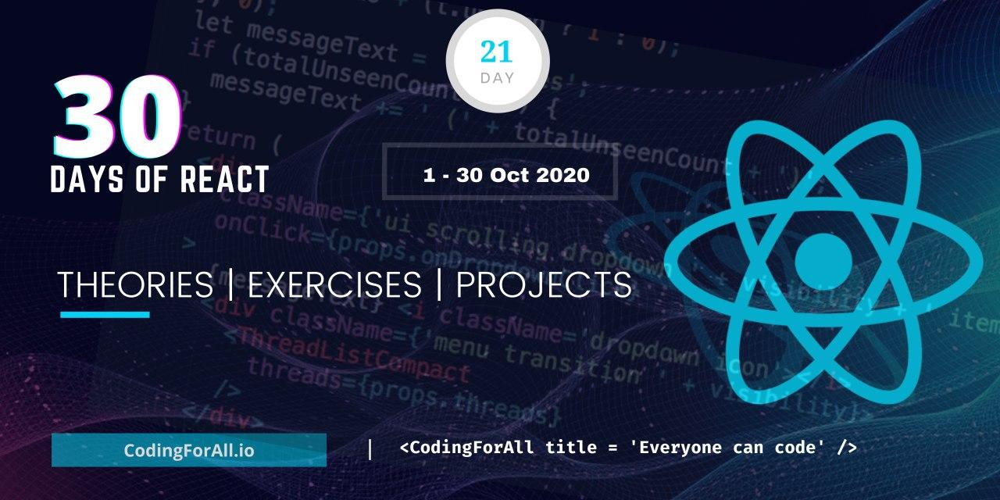

<div align="center">
  <h1> 30 Days Of React: Introducing React Hooks</h1>
  <a class="header-badge" target="_blank" href="https://www.linkedin.com/in/asabeneh/">
  
  </a>
  <a class="header-badge" target="_blank" href="https://twitter.com/Asabeneh">
  
  </a>

<sub>Author:
<a href="https://www.linkedin.com/in/asabeneh/" target="_blank">Asabeneh Yetayeh</a><br>
<small> October, 2020</small>
</sub>

</div>

[<< Day 20](../20_projects/20_projects.md) | [Day 22>>]()



- [Introducing React Hook](#introducing-react-hook)
  - [Basic Hooks](#basic-hooks)
    - [State Hook](#state-hook)
    - [Effect Hook](#effect-hook)
    - [Context Hook](#context-hook)
  - [Additional Hook](#additional-hook)
- [Exercises](#exercises)
  - [Exercises: Level 1](#exercises-level-1)

# Introducing React Hook

In the previous, section you have learned how to use React with hooks which is the older version. Currently, hooks has been introduced to React.

Hooks are a new addition in React 16.8. They allow you use state, life cycle methods and other React features without writing a class component. If we are using hooks we can have only a functional component in the entire application. For more detail explanation you check [React documentation](https://reactjs.org/docs/hooks-reference.html).

Different hooks have been introduced to React:Basic hooks and additional hooks

## Basic Hooks

The basic hooks are:

- useState
- useEffect
- useContext

### State Hook

Using hooks we can access state without writing a class based component. Let's use the same example we used for class based components on day 8.

To use hooks, first we should import the _useState_ hooks from react. The useState is a function which takes one argument and returns a current state and functions that lets you update it.

```js
// index.js
import React, { useState } from 'react'
import ReactDOM from 'react-dom'

const App = () => {
  // Declaring new state variable
  const [count, setCount] = useState(0)

  return (
    <div className='App'>
      <h1>{count} </h1>
      <button onClick={() => setCount(count + 1)}>Add One</button>
    </div>
  )
}
const rootElement = document.getElementById('root')
ReactDOM.render(<App />, rootElement)
```

We use the setCount to update the state. The initial state value is 0.

In the above example, we used an increment method. Let's also a decrement method.

```js
// index.js
import React, { useState } from 'react'
import ReactDOM from 'react-dom'

const App = () => {
  // Declaring new state variable
  const [count, setCount] = useState(0)

  return (
    <div className='App'>
      <h1>{count} </h1>
      <button onClick={() => setCount(count + 1)}>Add One</button> <button onClick={() => setCount(count - 1)}>Minus One</button>
    </div>
  )
}
const rootElement = document.getElementById('root')
ReactDOM.render(<App />, rootElement)
```

We can also write separate function instead of writing our function inside the curly brackets.

```js
// index.js
import React, { useState } from 'react'
import ReactDOM from 'react-dom'

const App = () => {
  // Declaring new state variable
  const [count, setCount] = useState(0)
  const addOne = () => {
    let value = count + 1
    setCount(value)
  }
  const minusOne = () => {
    let value = count - 1
    setCount(value)
  }
  return (
    <div className='App'>
      <h1>{count} </h1>
      <button onClick={addOne}>Add One</button> <button onClick={minusOne}>Minus One</button>
    </div>
  )
}
const rootElement = document.getElementById('root')
ReactDOM.render(<App />, rootElement)
```

Let us do more example about state, in the following example we will develop small application which shows either a dog or cat.
We can start by setting the initial state with cat then when it is clicked it will show dog and alternatively. We need one method which changes the animal alternatively. See the code below. If you want to see live click [here](https://codepen.io/Asabeneh/full/LYVxKpq).

```js
// index.js
import React, { useState } from 'react'
import ReactDOM from 'react-dom'
const App = () => {
  // declaring state
  const url =
    'https://www.smithsstationah.com/imagebank/eVetSites/Feline/01.jpg'

  const [image, setImage] = useState(url)

  const changeAnimal = () => {
    let dogURL =
      'https://static.onecms.io/wp-content/uploads/sites/12/2015/04/dogs-pembroke-welsh-corgi-400x400.jpg'
    let catURL =
      'https://www.smithsstationah.com/imagebank/eVetSites/Feline/01.jpg'
    let result = image === catURL ? dogURL : catURL
    setImage(result)
  }

  return (
    <div className='App'>
      <h1>30 Days Of React</h1>
      <div className='animal'>
        
      </div>

      <button onClick={changeAnimal} class='btn btn-add'>
        Change
      </button>
    </div>
  )
}
const rootElement = document.getElementById('root')
ReactDOM.render(<App />, rootElement)
```

Now, let's put all the codes we have so far and also let's implement state using the useState hooks when it is necessary.

```js
// index.js
import React, { useState } from 'react'
import ReactDOM from 'react-dom'
import asabenehImage from './images/asabeneh.jpg'
import './index.scss'

// Fuction to show month date year
const showDate = (time) => {
  const months = [
    'January',
    'February',
    'March',
    'April',
    'May',
    'June',
    'July',
    'August',
    'September',
    'October',
    'November',
    'December',
  ]

  const month = months[time.getMonth()].slice(0, 3)
  const year = time.getFullYear()
  const date = time.getDate()
  return ` ${month} ${date}, ${year}`
}

// User Card Component
const UserCard = ({ user: { firstName, lastName, image } }) => (
  <div className='user-card'>
    
    <h2>
      {firstName}
      {lastName}
    </h2>
  </div>
)

// A button component
const Button = ({ text, onClick, style }) => (
  <button style={style} onClick={onClick}>
    {text}
  </button>
)

// CSS styles in JavaScript Object
const buttonStyles = {
  backgroundColor: '#61dbfb',
  padding: 10,
  border: 'none',
  borderRadius: 5,
  margin: 3,
  cursor: 'pointer',
  fontSize: 18,
  color: 'white',
}

const Header = (props) => {
  const {
    welcome,
    title,
    subtitle,
    author: { firstName, lastName },
    date,
  } = props.data

  return (
    <header style={props.styles}>
      <div className='header-wrapper'>
        <h1>{welcome}</h1>
        <h2>{title}</h2>
        <h3>{subtitle}</h3>
        <p>
          {firstName} {lastName}
        </p>
        <small>{date}</small>
      </div>
    </header>
  )
}

const Count = ({ count, addOne, minusOne }) => (
  <div>
    <h1>{count} </h1>
    <div>
      <Button text='+1' onClick={addOne} style={buttonStyles} />
      <Button text='-1' onClick={minusOne} style={buttonStyles} />
    </div>
  </div>
)

// TechList Component
const TechList = (props) => {
  const { techs } = props
  const techsFormatted = techs.map((tech) => <li key={tech}>{tech}</li>)
  return techsFormatted
}

// Main Component
const Main = (props) => {
  const {
    techs,
    user,
    greetPeople,
    handleTime,
    changeBackground,
    count,
    addOne,
    minusOne,
  } = props
  return (
    <main>
      <div className='main-wrapper'>
        <p>Prerequisite to get started react.js:</p>
        <ul>
          <TechList techs={techs} />
        </ul>
        <UserCard user={user} />
        <Button
          text='Greet People'
          onClick={greetPeople}
          style={buttonStyles}
        />
        <Button text='Show Time' onClick={handleTime} style={buttonStyles} />
        <Button
          text='Change Background'
          onClick={changeBackground}
          style={buttonStyles}
        />
        <Count count={count} addOne={addOne} minusOne={minusOne} />
      </div>
    </main>
  )
}

// Footer Component
const Footer = (props) => {
  return (
    <footer>
      <div className='footer-wrapper'>
        <p>Copyright {props.date.getFullYear()}</p>
      </div>
    </footer>
  )
}

const App = (props) => {
  const [count, setCount] = useState(0)
  const [backgroundColor, setBackgroundColor] = useState('')

  const showDate = (time) => {
    const months = [
      'January',
      'February',
      'March',
      'April',
      'May',
      'June',
      'July',
      'August',
      'September',
      'October',
      'November',
      'December',
    ]

    const month = months[time.getMonth()].slice(0, 3)
    const year = time.getFullYear()
    const date = time.getDate()
    return ` ${month} ${date}, ${year}`
  }
  const addOne = () => {
    setCount(count + 1)
  }

  // method which subtract one to the state
  const minusOne = () => {
    setCount(count - 1)
  }
  const handleTime = () => {
    alert(showDate(new Date()))
  }
  const greetPeople = () => {
    alert('Welcome to 30 Days Of React Challenge, 2020')
  }
  const changeBackground = () => {}

  const data = {
    welcome: 'Welcome to 30 Days Of React',
    title: 'Getting Started React',
    subtitle: 'JavaScript Library',
    author: {
      firstName: 'Asabeneh',
      lastName: 'Yetayeh',
    },
    date: 'Oct 7, 2020',
  }
  const techs = ['HTML', 'CSS', 'JavaScript']

  const user = { ...data.author, image: asabenehImage }

  return (
    <div className='app'>
      {backgroundColor}
      <Header data={data} />
      <Main
        user={user}
        techs={techs}
        handleTime={handleTime}
        greetPeople={greetPeople}
        changeBackground={changeBackground}
        addOne={addOne}
        minusOne={minusOne}
        count={count}
      />
      <Footer date={new Date()} />
    </div>
  )
}

const rootElement = document.getElementById('root')
ReactDOM.render(<App />, rootElement)
```

### Effect Hook

### Context Hook

## Additional Hook

# Exercises

## Exercises: Level 1

Convert everything you wrote to React hooks.

🎉 CONGRATULATIONS ! 🎉
[<< Day 20](../20_projects/20_projects.md) | [Day 22>>]()
