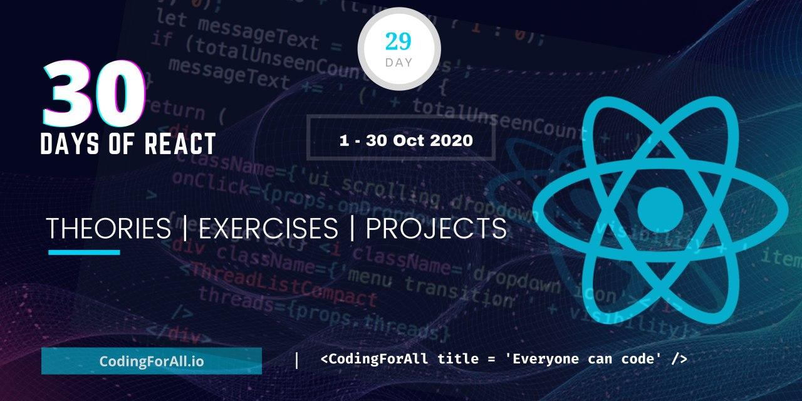

  <h1> 30 Days Of React: Project</h1>
  
  

Author:
<a href="https://www.linkedin.com/in/asabeneh/" target="_blank">Asabeneh Yetayeh</a> 
<small> October, 2020</small>

[<< Day 28](../27_Ref/27_ref.md) | [Day 29 >>](../29_explore/29_explore.md)

# Explore

Congratulations for making to this far. You are are unstoppable. So far you have learned lots of concepts and also built several mini-projects. I believe those mini-projects have helped you to understand React very well. After this, you can work on a sole or group React project. You can also expand your skill by using different packages (classnames, lodash, react-helmet, recharts, etc.), implementing PWA, styled components and CSS libraries with React application. In addition, learn SEO, accessibility, responsiveness and browser compatibility. Explore more and increase your knowledge in the domain. Read the [React documentation](https://reactjs.org/). Now, you should feel confident enough about your React skill and you should also start applying for entry or junior softer developer or front end developer positions. No one will tell you that you are read for a job, so you should make yourself ready.

# Exercises

## Exercises: Level 1

1. Polish your GitHub and make your projects as clean as possible
2. Work on your portfolio
3. Create LinkedIn account if you don't have yet. If you have LinkedIn account make it as attractive as possible. It will give a high chance for potential recruiters and companies to know more about you. In addition, there are lots of materials and people who can be used as motivation on daily basis.
4. Follow the author on LinkedIn, Twitter or GitHuh if he created impact on your life.
5. Become an ambassador of CodingForAll by supporting and advocating our causes.
6. Write about 30DaysOfReact on different platforms and create an opportunity for others to get a valuable skill.

## Exercises: Level 2

Coming ...

🎉 CONGRATULATIONS ! 🎉

[<< Day 27](../27_Ref/27_ref.md) | [Day 29>>]()
